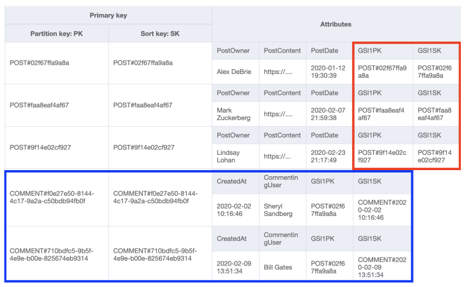

# DynamoDB tutorial

## Relational DB vs NoSQL DB

Relation databases are not suited for:
* Unstructured data
* Big data applications - huge volumes of data or high frequency data

NoSQL DBs
* While it is called NoSQL, we can actually use SQL even with DynamoDB
with the help of services like RedShift and Apache Hive. So a better
name might be Not-Only-SQL
* Non-relational in nature
* Support unstructured data
* Well suited for big data applications. Big data can be described using:
  * Volume - large volumes of data.
  * Velocity - a huge number of concurrent read/write operations, often
  in real time.
  * Variety - largely unstructured or semi-structured data.


### ACID
* A - Atomicity. A transaction can either execute completely or not at all.
* C - Consistency. Once a transaction has been committed, it has to conform 
to the given schema.
* I - Isolation. Requires that the concurrent transactions execute separately
from one another.
* D - Durability. The ability of the database to recover from unexpected
system failures or an outage. So transactions are typically logged and in
case there is an outage or failure, these transactions can be replayed and
applied back to the database once the system is back up and running.

Relational DBs implement ACID in a very strict sense. These properties work
together to ensure a consistent and desired behavior of the relational
database transactions. However, this results in the loss of some flexibility,
and it vastly hinders the database performance and its ability to scale
horizontally, especially when dealing with big data.

NoSQL DBs often trade some ACID properties and thereby they provide us
with a more flexible data model.

### Scaling
SQL by default relies on vertical scaling. To enable horizontal scaling
you have to re-work your model, need additional investments into infra.

NoSQL by default relies on horizontal scaling.

### Interaction APIs
SQL uses SQL (Structured Query Language) for interaction.

NoSQL uses object-based APIs for interaction. So you use partition keys 
or primary keys to look up any data stored.

## NoSQL

### Types of NoSQL DBs
* **Columnar DBs** - column orientated. Optimized for reading and writing
columns of data as opposed to rows of data (relational DB). Great for things like data
warehousing and analytics. Reduces the overall disc I/O requirements and
the amount of data that needs to be loaded from the disc. Some examples are
Apache Casandra, Apache HBase, Amazon Redshift.
* **Key-value store** - data stored in key-value pairs. Optimized for read-heavy
application workloads. Ex. social networking, gaming, media sharing applications.
They are also suitable for compute-heavy workloads like recommendation engines.
These DBs often leverage in-memory caching to improve application performance
by storing critical pieces of data in memory and that allows for faster access.
Examples are Redis, Couchbase Server, Memcached, DynamoDB.
* **Graph DBs** - good for exploring data that is structured like a graph or
a tree for example. We have nodes and these nodes have relationships with
other nodes through edges. These are used for huge data sets like social
networking sites where everything is related. Some examples are Neo4j,
OrientDB, GraphDB.
* **Document DBs** - store semi-structured data as documents. Typically JSON
or XML documents. Some examples are Cassandra, Couchbase, MongoDB, DynamoDB.

DynamoDB is a key-value store, as well as a Document DB. It also supports
API operations in JSON format. DynamoDB does not actually store the data
in JSON format, but for all practical purposes, applications interact with
DynamoDB using the JSON format.

## DynamoDB

DynamoDB is
* Serverless - you do not have to manage the servers or any infrastructure
to use DynamoDB.
* A Cloud DB - Available in AWS
* NoSQL - built for big data
* Fast - High throughput with low latency. Can be further improved by using
DACS.
* Flexible - can store unstructured data
* Cost-effective - pay on the capacity that you provision for each table
* Highly scalable - can scale to demand
* Fault-tolerant - automatically replicates to multiple AZs, supports cross
region replication.
* Secure - has fine-grained access control.


A table in DynamoDB is a grouping of records that conceptually belong together.
In a relational DB a table contains one entity, in DynamoDB it contains all the entities.
This helps to avoid the join operation, which is expensive as a DB scales.

A relational DB has a specified schema, that describes and enforces the shape of each
record in the table. At the DB level, DynamoDB is schemaless. You have to enforce a
schema in your application code.

An item is a single record in a DynamoDB table. Same as a row in a relational DB.

A dynamoDB item is made up of attributes, which are typed data values holding info
about the element. Attributes are similar to column values on relational records, except
not required.

### DynamoDB Tables
Tables are the top level entities in DynamoDB and all the tables within
the given AWS region can be looked at as a single DB.

In order to better organize tables related to our application, a good 
approach is to follow some kind of naming convention to name our tables.
One way could be to prefix each table with some identity. For example,
if I'm building a test application, then I could prefix them with `test.`
or `test_.`

Different AWS regions can have their own tables and these tables are
separate from each other. For example US-West-1 and US-West-2 can have
tables with the same names and be treated as two different entities as
they lie in two different locations.

There is no concept of foreign key relationships in DynamoDB. Two tables
are totally separate from each other. Each table is an independent entity.

Different table items can have different attributes. The only common attribute
that must be present in each item in the table is the primary key.

A primary key must be declared for a table on creation. Can be simple (a single value)
or composite (two values). Primary key selection and design is the most important
part of data modeling with DynamoDB. Almost all of your data access will be driven 
off primary keys.

The way you configure your primary key may allow for one read or write access pattern,
but may prevent you from handling a second access pattern. Secondary indexes allow you
to reshape your data into another format for querying, so you can add additional access
patterns to your data. When you create a secondary index on your table, you specify
the primary keys for your secondary index, just like when you're creating a table. AWS
will copy all items from your main table into the secondary index in the reshaped form.
You can then make queries against the secondary index.


### DynamoDB Data Types
Scalar types
* Exactly one value. Ex. string, number, binary, boolean, and null
* Depending on how the values are used, there are different max size
limitations.
* You cannot store empty string values in Dynamo.
* Numbers are sent across as strings through the API, but for any 
mathematical calculation they are treated as numbers.
* Binary data is blocks of compressed text, encrypted data, or even images.
* Empty values are not allowed in binary data types.
* Keys or index attributes only support string, number, and binary scalar
types.

Set types
* Multiple scalar values. Ex. string set, number set, binary set.
* Unordered collection of strings, numbers, or binary.
* Only non-empty values.
* No duplicates allowed.
* All values must be of the same Scalar type in a set.

Document types
* Complex structure with nested attributes. Ex. list and map.
* Nesting up to 32 levels deep.
* Only non-empty values within lists and maps.
* Empty lists and maps are allowed.
* Lists are ordered collection of values. Can have multiple data types
within one list. There is no restriction on the data types that can be 
stored in a list element.
* Maps are unordered collections of key-value pairs. Ideal for storing JSON
documents. There are no restrictions on the data types that can be stored
in a map element, and the elements in a map can be of different types as well.

When we create a table or an index, like a local or global secondary index,
we must specify the data type. The keys of any table can only be one of
Scalar types. That is string, number, binary.

Internally, DynamoDB doesn't actually store JSON, but it has its own
native data types.

### DynamoDB Consistency Model
DynamoDB automatically replicates your data between multiple facilities.
DynamoDB stores your data on at least 3 copies of high speed SSDs located
in three different facilities within the region.


When we write to one of our DBs, then that data is eventually replicated
to the other facilities. This usually happens within 1-2 seconds. If you
are instantly reading the data as well, then that means that the data might
not be up-to-date, as the data has not been synchronized across all facilities.
When a request comes in, then it will hit one of the facilities.

Considering that time constraint, DynamoDB supports two types of reader 
operations - strongly consistent reads and eventually consistent reads.

Strong consistency:
* The most up-to-date data
* Must be requested explicitly

Eventual consistency:
* May or may not reflect the latest copy of data. Provides you with data
from one of its facilities. Not reflecting the actual data would happen
only if the data was written in the last second or so.
* Default consistency for all operations
* 50% cheaper

Most applications, most of the time, should be fine with eventual consistency.

### DynamoDB Capacity
Since DynamoDB tables are independent of each other, their performance
can be controlled and tuned individually. To do this, we must provision
throughput capacity for each table that we create in DynamoDB.

Throughput capacity
* Allows for predictable performance at scale
* Used to control read/write throughput
* Supports auto-scaling
* Defined using RCUs and WCUs
* Major factor in DynamoDB pricing
* 1 capacity unit = 1 request/sec. There are read capacity units (RCU) and
write capacity units (WCU).

DynamoDB pricing is based on a pay per use concept, meaning you pay only
for what you use. It charges based on RCUs and WCUs consumed, and on
volume data.

RCU - Read Capacity Unit
* 1 RCU = 1 strongly consistent table read/sec
* 1 RCU = 2 eventually consistent table reads/sec
* An item of up to 4 KB of size. The items are rounded up to the nearest
next 4 KB to get the number of RCUs needed.

WCU - Write Capacity Unit
* 1 WCU = 1 table write/sec
* An item of up to 1 KB of size. Same as with RCU, rounding is done.

DynamoDB has burst capacity
* To provide for occasional bursts or spikes
* 5 minutes of unused read and write capacity
* Can get consumed quickly
* Must not be relied upon
* Beyond this our requests will likely get throttled

Scaling
* Happens async in the background without any downtime
* Scaling up: As and when needed
* Scaling down: up to 4 times a day
* Affects partition behavior (Important!)
* 1 partition supports up to 1000 WCUs or 3000 RCUs

On-Demand Capacity - DynamoDB charges you for the data reads/writes your
application performs on your tables. You do not need to specify how much
read and write throughput you expect your application to perform because 
DynamoDB instantly accommodates your workloads as they ramp up or down.
This is a good option if you:
* Create new tables with unknown workloads
* Have unpredictable application traffic
* Prefer the ease of paying for only what you use

### DynamoDB Partitions
DynamoDB stores data in partitions. A partition is nothing more than a
block of memory allocated that will be used for storage. A table can have
one or more partitions depending on its size and region throughput. The
partitions are managed internally by DynamoDB.

1 partition = 10 GB of data, 1000 WCUs/3000 RCUs. If our application 
exceeds one or more of these limits, then DynamoDB would allocate more
partitions. This happens in the background with no downtime.

When we create a new table, the initial number of partitions are determined
by the provision capacity. Let's say that we create a table with 500 RCUs
and 500 WCUs. Number of partitions would then be:
```
PARTITIONS NEEDED BASED ON RCUs = 500 RCUs / 3000 PER-PARTITION-MAX-RCUs = 0.16(6)
PARTITIONS NEEDED BASED ON WCUs =  500 WCUs / 1000 PER-PARTITION-MAX-WCUs = 0.5
PARTITIONS NEEDED BASED ON RCUs + PARTITIONS NEEDED BASED ON WCUs = 0.67
0.67 ~= 1 partition
```

Once this partition runs out of the allowed memory of 10 GB, then additional
partitions would be allocated.

Now suppose you increase your provisioned amounts to 1000 RCUs and 1000 WCUs.
```
PARTITIONS NEEDED BASED ON RCUs = 1000 RCUs / 3000 PER-PARTITION-MAX-RCUs = 0.33(3)
PARTITIONS NEEDED BASED ON WCUs =  1000 WCUs / 1000 PER-PARTITION-MAX-WCUs = 1
PARTITIONS NEEDED BASED ON RCUs + PARTITIONS NEEDED BASED ON WCUs = 1.33
1.33 ~= 2 partitions
```

DynamoDB would distribute the data uniformly between the two partitions. It
will then de-allocate the old partition. The throughput capacity is also
equally divided between the partitions. So both new partitions receive
500 WCUs and 500 RCUs. Once a partition is allocated, you will not be able
to deallocate it when you scale down the table capacity. This is a problem
because the provision capacity gets divided between all the partitions.
This will cause our table to perform at a far lower throughput than desired.

The only way to get rid of extra partitions is to re-create the table.

### DynamoDB Indexes

It is good to have a string as a partition key, but not required. Also, it's
good to have a number as a sort key, but again, not required.

Since local secondary indexes can only be defined on create time, then it's
good to spend a considerable amount of time thinking about what use cases 
would be required.

#### Primary key
Each item in a table is uniquely identified by a primary key.
The primary key definition must be defined at the creation of the table, and
then primary key must be provided when inserting a new item.

There are two types of primary key:
* a **simple primary key** made up of just a partition key. Similar to accessing
rows in a SQL table by a primary key. Ex. get a row from a Users table with
a username, which is the primary key.
* a **composite primary key** made up of a partition key and a sort/range key. The sort key
is used to sort items with the same partition. Ex. Orders table for
recording customers on an e-commerce site. The partition key would be the
CustomerId, and the sort key would be the OrderId. The composite primary key 
enables sophisticated query patterns, including
grabbing all items with the given partition key or using the sort key to
narrow the relevant items for a particular query.

Each item in a table is uniquely identified by a primary key, even with
the composite key. When using a table with a composite primary key, you
may have multiple items with the same partition key, but different sort
keys. You can only have one item with a particular combination of partition
key and sort key.

The partition key is used to decide which partition the entry should go in.
A hashing function is run on the key and based on that hash a partition is
chosen.

In DynamoDB there is no way to query data without specifying the partition
key.

You can also perform scan operations that do not require you to specify
partition keys. This is, however, not recommended, unless really necessary.
Operations such as these, in most cases, indicate insufficient data modeling.


### Secondary Indexes
When creating a secondary index, you will need to specify the key schema of your index.
The key schema is similar to the primary key of your table - you will state the partition
and sort key (if desired) for your secondary index that will drive your access patterns.

#### Local secondary index
A local secondary index uses the same partition key as your table's primary key, but
a different sort key. This can be a nice fit when you are often filtering your data
by the same top-level property, but have access patterns to filter your dataset
further. The partition key can act as the top-level property, and the different sort
key arrangements will act as your more granular filters.

Local secondary indexes must be created when you create your table.
You cannot add a local secondary index later on. You can create up to
5 such local secondary indexes.

The RCUs and WCUs are shared with the local secondary indexes. You can
perform eventually consistent as well as strongly consistent queries
using these local secondary indexes.

#### Global secondary index
If you'd want to get information that isn't related to the primary
partition key, then this could be used. You can choose any attributes you want
for your partition key and your sort key. Global secondary indexes are used much
more frequently with DynamoDB due to their flexibility. For example, in the table, we'd
want to get all the employees working in NYC and sorted by their date of
joining.


The partition key is different from that of the primary key. You can 
define up to 5 of these as well. Unlike the local secondary indexes,
these can be created at any time.

Global secondary indexes are stored separately in their own partitions.
They have their own throughput capacity as well, so their RCUs and WCUs
are not shared with the base table. You can only perform eventually
consistent reads with global secondary indexes. Data is replicated from the core table
to global secondary indexes in an async manner. This means it's possible that the data
returned in your global secondary index does not reflect the latest writes in your main
table. The delay in replication from the main table to the global secondary indexes 
is not large, but it may be something you need to account for in your application.

There is no uniqueness constraint with the global secondary index.

|                        | Key schema                                                  | Creation time                         | Consistency                                                                                                            |
|------------------------|-------------------------------------------------------------|---------------------------------------|------------------------------------------------------------------------------------------------------------------------|
| Local secondary index  | Must use same partition key as the base table               | Must be created when table is created | Eventual consistency by default. Can choose to receive strongly-consistent reads at a cost of higher throughput usage. |
| Global secondary index | May use any attribute from table as partition and sort keys | Can be created after the table exists | Eventual consistency only.                                                                                             |

### DynamoDB Streams
Streams are an immutable sequence of records that can be processed by multiple,
independent consumers.


With DynamoDB streams, you can create a stream of data that includes a record of 
each change to an item in your table. Whenever an item is written, updated, or 
deleted, a record containing the details of that record will be written to your
DynamoDB stream. You can then process this stream with AWS Lambda or other compute 
infrastructure.


### Time-to-live
TTLs allow you to have DynamoDB automatically delete items on a per-item basis. 
This is a great option for storing short-term data in DynamoDB as you can use
TTL to clean up your database rather than handling it manually via a scheduled job.

To use TTL, you specify an attribute on your DynamoDB table that will serve as the 
marker for item deletion. For each item that you want to expire, you should store a 
Unix timestamp as a number in your specified attribute. This timestamp should state 
the time after which the item should be deleted. DynamoDB will periodically review 
your table and delete items that have your TTL attribute set to a time before the 
current time.

For items that you don’t want to automatically expire, you can simply not set the 
TTL attribute on the item.

Items are generally deleted in a timely manner, but AWS only states that items 
will usually be deleted within 48 hours after the time indicated by the attribute.

### Partition
Partitions are the core storage units underlying your DynamoDB table. Dynamo shards 
your data across multiple server instances.

When a request comes into DynamoDB, the request router looks at
the partition key in the request and applies a hash function to it.
The result of that hash function indicates the server where that data
will be stored, and the request is forwarded to that server to read or
write the data as requested.

In earlier versions of DynamoDB, you needed to be more aware of
partitions. Previously, the total throughput on a table was shared
evenly across all partitions. You could run into issues when
unbalanced access meant you were getting throttled without using
your full throughput. You could also run into an issue called
throughput dilution if you temporarily scaled the throughput very
high on your table, such as if you were running a bulk import job,
then scaled the throughput back down.

All of this is less of a concern now as the DynamoDB team has
added a concept called adaptive capacity. With adaptive capacity,
throughput is automatically spread around your table to the items
that need it. There’s no more uneven throughput distribution and
no more throughput dilution.

### Consistency
At a general level, consistency refers to whether a particular read operation 
receives all write operations that have occurred prior to the read.

When you write data to DynamoDB, there is a request router that is the frontend for 
all requests. It will authenticate your request to ensure you have access to write 
to the table. If so, it will hash the partition key of your item and send that key 
to the proper primary node for that item.

The primary node for a partition holds the canonical, correct data for the items 
in that node. When a write request comes in, the primary node will commit the write 
and commit the write to one of two secondary nodes for the partition. This ensures 
the write is saved in the event of a loss of a single node.

After the primary node responds to the client to indicate that the write was 
successful, it then asynchronously replicates the write to a third storage node.

The secondary nodes provide fault-tolerance, and distributed load for read requests.
The reads, however, can be eventually consistent, because the write replication happens
async.

So the order of operations
1. PutItem is called by the client with a given partition key
2. The partition key is found to map to partition X
3. Write data for item to partition X
4. Copy write to a secondary node for partition X
5. Respond to client that write succeeded
6. Copy write to another node async


The two types of consistency in Dynamo are 
* Strong consistency
  * Any read will reflect all writes that happened beforehand
  * Consumes more read capacity
* Eventual consistency
  * Reads may be slightly outdated
  * Consumes less read capacity

Dynamo defaults to eventual consistency. Can opt into strong consistency via an
API parameter when performing your read.

Should consider your needs when choosing your indexes as well. A local secondary
index allows for strongly-consistent reads, just like the underlying table. A
global secondary index allows only eventually-consistent reads.

### DynamoDB limits
A single item is limited to 400 KB of data (vs 16 MB in MongoDB, 2GB in Cassandra).
The size limit is intentional to push the user towards proper data modeling. The 
larger your item size, the slower your read. You should break down larger items into 
smaller items and do more targeted operations.

This limit will affect you most commonly as you denormalize your data. When you 
have a one-to-many relationship, you may be tempted to store all the related items 
on the parent item rather than splitting this out. This works for many situations 
but can blow up if you have an unbounded number of related items.

The maximum result set size for the Query and Scan operations is 1 MB of data. This 
is before any filter expressions are considered. If you have a need for more than 1 MB,
then you should paginate.

This 1MB limit is crucial to keeping DynamoDB’s promise of consistent single-digit 
response times.

A single partition can have a maximum of 3000 Read Capacity Units or 1000 Write 
Capacity Units. Remember, capacity units are on a per-second basis, and these 
limits apply to a single partition, not the table as a whole. Thus, you will need 
to be doing 3000 reads per second for a given partition key to hit these limits.
This is pretty high traffic volume, and not many users will hit it, though it’s 
definitely possible. If this is something your application could hit, you’ll need 
to look into read or write sharding your data.

The last limit you should know about involves local secondary
indexes and item collections. An item collection refers to all items
with a given partition key, both in your main table and any local
secondary indexes. If you have a local secondary index, a single
item collection cannot be larger than 10GB. If you have a data
model that has many items with the same partition key, this could
bite you at a bad time because your writes will suddenly get rejected
once you run out of partition space.

The partition size limit is not a problem for global secondary indexes. If the items in a global secondary index for a partition key
exceed 10 GB in total storage, they will be split across different
partitions under the hood. This will happen transparently to you—
one of the significant benefits of a fully-managed database.

Multiple entities are stored in a DynamoDB base. In order to do that, you need to
overload your keys, which means using generic names for your primary keys and
using different values depending on the type of item (ex. ORG#123, USER#123).

### Interacting with DynamoDB
When interacting with a relational DB, you'll often do so using SQL. In DynamoDB,
you usually do that using the AWS SDK, or a third party library in code. 

There are basically three areas one can group the API actions into:
* Item-based actions - when you're operating on specific items
  * GetItem - used for reading a single item from a table
  * PutItem - used for writing an item to a table. This can completely overwrite an 
  existing item with the same key, if any
  * UpdateItem - used for updating an item in a table. This can create a new item 
  if it doesn't previously exist, or it can add, remove, or alter properties on an 
  existing item.
  * DeleteItem - used for deleting an item from a table.
* Queries - operating on an item collection
* Scans - operating on an entire table

#### Item-based actions
There are three rules around item-based actions:
* The full primary key must be specified in your request
* All actions to alter data—writes, updates, or deletes—must use an item-based
action.
* All item-based actions must be performed on your main table, not a secondary index.

You can't make a write operation to DynamoDB that says, "Update the attribute X for 
all items with a partition key of Y" (assuming a composite primary key). You would 
need to specify the full key of each of the items you’d like to update.

The above described single-item actions can be performed in batches and transactions.
These allow for multiple operations in a single request. But in here, still, you need
to specify the exact items on which to operate. The actions are split up in Dynamo, but
save you from sending multiple requests.

In a batch request, the actions can succeed and fail independently. So one write won't
affect another in the batch.

In a transactional request, it is all or nothing. If one fails, everything fails, causing
a rollback.

DynamoDB sets its limits to disallow writing queries that do not scale. You need a
partition key as that allows for a O(1) lookup. No matter how large your table 
becomes, including a partition key makes it a constant time operation. With a 
Query you can do >=, <=, begins_with(), between, but not contains(), ends_with().
This is because an item collection is ordered and stored as a B-tree. The time 
complexity of a B-tree search is O(log n). Dynamo limits the data size so that you
wouldn't be querying too much at one time, thus keeping speed. 

#### Query
A Query action lets you retrieve multiple items with the same partition key. Especially
useful when modeling and retrieving data that includes relations. We can add a condition
on the sort key.

#### Scan
A Scan can take a long time to run. It'll take everything. If you have a large table,
you'll have to paginate. You can consider using it if:
* You have a very small table
* You're exporting all data from your table to a different sytem
* In exceptional situations, where you have specifically modeled a sparse secondary 
index in a way that expects a scan. 

#### Query structure
````ts
items = client.query(
  TableName='MoviesAndActors',
  KeyConditionExpression='#actor = :actor AND #movie BETWEEN :a AND :m',
  ExpressionAttributeNames={
    '#actor': 'Actor',
    '#movie': 'Movie'
  },
  ExpressionAttributeValues={
    ':actor': { 'S': 'Tom Hanks' },
    ':a': { 'S': 'A' },
    ':m': { 'S': 'M' }
  }
)
````

Expression attribute values - they start with a colon (:). They are substituted into the
KeyConditionExpression. This kind of structure simplifies parsing and validation the 
expression, as typing is separated from the expression.

Expression attribute names - start with a bars character (#). Specify the names of
the attributes you are evaluating in your request. You are not required to use this,
but they come in handy when you might have a clash with reserved keywords. Also, when 
you have a name with a period, as that would be interpreted as accessing a nested object.

Don't use an ODM (ORM equivalent). Fetching isn't straight-forward in Dynamo. It depends
heavily on your primary key design. Could use a helper library to translate the data
to objects, though, just not for queries.

You can provide additional optional properties to DynamoDB queries:
* ConsistentRead - set it to true to get a strongly-consistent read. It's available 
for GetItem, BatchGetItem, Query, Scan. Can only use on local secondary indexes, as
all global ones are eventually consistent.
* ScanIndexForward - controls which direction you are reading the results from the
sort key. Available on Query. Setting it to false reads it in descending order.
* ReturnValues - when performing a modification action, then you could get some
attributes back using this. Usable on PutItem, UpdateItem, DeleteItem, TransactWriteItem.
By default, Dynamo will not return any info for these operations. There are a couple
of options for this property:
  * NONE - return no attributes. The default.
  * ALL_OLD - return all attributes as they were BEFORE the operation was applied.
  * UPDATED_OLD - any attributes that were updated, return them as they were BEFORE the operation.
  * ALL_NEW - return all as they are AFTER the operation.
  * UPDATED_NEW - any attributes AFTER the operation.
* ReturnConsumedCapacity - returns info on the capacity units used. Can use it when
designing your table, for example, to see what access patterns consume how much. Could
also pass the info onward to the customers that are billed based on the units.
* ReturnItemCollectionMetrics - item collections cannot be larger than 10 GB for a 
local secondary index. You can use this property to give advanced warnings.


#### AWS Management Console
This is the GUI for managing your data.
#### AWS CLI
The command line interface. Run `aws configure` first to set up your CLI.
#### AWS SDK
The `DocumentClient` class provides higher level access. Abstracts more away.
Easier to use for item level operations. Maps to appropriate data types.

When inserting items with the same ID, then the previous one will get replaced.

When doing a conditional write, and it fails, then a WCU is still consumed.

Atomic counters are counters that increment/decrement atomically. Atomic means 
that it's independent of other similar operations. All requests are applied in order.
Not suitable for applications demanding high degree of accuracy.

When running a query, you are doing a direct lookup to a selected partition based on
primary or secondary partition/hash key.

Scan scans through the whole table looking for elements matching the criteria.

Query usually returns the results within a 100ms, whereas scan might even take a few
hours to find the relevant data.

#### Expressions
There are five types of expressions in DynamoDB:
* **Key condition expressions** - used in Query API calls to describe which items you 
want to retrieve in your query. Can only be used on elements of the primary key.
You can use simple comparisons in your sort key conditions, such as greater than (>), 
less than (<), or equal to (=). `KeyConditionExpression="#c = :c AND #ot BETWEEN 
:start and :end"`. While you can use greater than, less than, equal to, or 
begins_with, every condition on the sort key can be expressed with the BETWEEN 
operator. Key expressions are critical when fetching multiple, heterogeneous
items in a single request. With the right combination of item collection design and 
proper key expressions, you can essentially 'join' your data just like a relational 
database but without the performance impact of joins.
* **Filter expressions** - used in Query and Scan operations to describe which items
should be returned to the client after finding items that match your key condition
expression. The key difference with a filter expression vs. a key condition
expression is that a filter expression can be applied on any attribute in the table,
not just those in the primary key. `FilterExpression="#genre = :genre"`. The major
drawback of this expression is that filtering is applied after querying all
the items necessary. Filter expressions can save you a bit of data sent over the 
wire, but it won’t help you find data more quickly. It's also worth considering if
you have a TTL field in your DB, then Amazon can take up to 48 hours to remove those
entries, so it'd be safer to include that condition in your queries as well. Overall,
don't rely on these too heavily.
  
* **Projection expressions** - used in all read operations to describe which attributes
you want to return on items that were read.  A projection expression is similar to a
filter expression in that its main utility is in reducing the amount of data sent 
over the wire in your response. While a filter expression works on an item-by-item 
basis, the projection expression works on an attribute-by-attribute basis within an 
item. `ProjectionExpression: "#actor, #movie, #role, #year, #genre"`. A projection 
expression is used to specify exactly the attributes you want to receive from the 
DynamoDB server. The projection expression can also be used to access nested
properties, such as in a list or map attribute. Projection expressions are subject to 
the same caveats as filter expressions—they are evaluated after the items are read 
from the table and the 1MB limit is reached. Thus, if you are looking to 
fetch a large number of items but each of them has a large attribute, you may find 
yourself paginating more than you’d like. If this is the case, you may need to 
create a secondary index with a custom projection that only copies certain 
attributes into the index. This will allow you to quickly query multiple items 
without having to paginate due to large, unneeded attributes.
* **Condition expressions** - used in write operations to assert the existing condition
(or non-condition) of an item before writing to it. Condition expressions are available 
on every operation where you will alter an item—PutItem, UpdateItem, DeleteItem, and 
their batch and transactional equivalents. They allow you to assert specific 
statements about the status of the item before performing the write operation. If 
the condition expression evaluates to false, the operation will be canceled. 
Condition expressions can operate on any attribute on your item, not just those in 
the primary key. This is because condition expressions are used with item-based 
actions where the item in question has already been identified by passing the key 
in a different parameter. Some reasons that you might want to use it are: do not 
overwrite using PutItem, prevent an UpdateItem from creating an invalid state, 
do not delete if the user is not the owner of an item. Without this property, 
you'd have to query before to check the conditions, and you would need to 
handle race conditions. In addition to the comparison operators, it has other 
functions that could be used:
  * attribute_exists() - check that an attribute exists
  * attribute_not_exists() - check that an attribute does not exist. 
  `ConditionExpression: "attribute_not_exists(#username)",`
  * attribute_type() - check an attribute's type
  * begins_with() - value begins with a substring
  * contains() - a string contains a substring
  * size() - check an attribute's size. For a string it's the length, binary is the number
  of bytes. For Lists, maps, sets it returns the number of elements in a set.
  `ConditionExpression: "size(#inprogress) <= 10",`
* **Update expressions** - used in the UpdateItem call to describe the desired updates
to an existing item. When using the UpdateItem API, you will only alter the 
properties you specify. If the item already exists in the table, the attributes 
that you don’t specify will remain the same as before the update operation. In an 
update expression, you need to state the changes you want to make. There are four 
verbs for stating these changes (`UpdateExpression="SET Name = :name, UpdatedAt = :updatedAt REMOVE InProgress"`):
  * SET: Used for adding or overwriting an attribute on an item. Can also be used 
  to add or subtract from a number attribute
  * REMOVE: Used for deleting an attribute from an item or deleting nested 
  properties from a list or map
  * ADD: Used for adding to a number attribute or inserting an element into a set 
  attribute
  * DELETE: Used for removing an element from a set attribute


Key condition expressions, filter expressions, and projection expressions are used
for read operations.

Condition expressions is for all write-based operations.

Update expressions is for update operations only.

All expressions may use the expression attribute names 
(`ExpressionAttributeNames={
  "#a": "Actor"
}`) and all expressions other
than the projection expression must use expression attribute values 
(`ExpressionAttributeValues={
  ":a": { "S": "Natalie Portman" }
}`).

Condition expressions can be used for checks across multiple items. If you want to
perform an action on a certain entity, but you do not have all the data needed
to decide whether to perform that action on the entity, then you can bind multiple
items together in a transaction and if a previous action fails, then the entire
thing fails. The TransactWriteItem API allows you to use up to 10 items in a 
single request. The below example first checks that the user is an admin account.
If so, then perform a delete.
```js
result = dynamodb.transact_write_items(
  TransactItems=[
    {
      "ConditionCheck": {
        "Key": {
          "PK": { "S": "Admins#<orgId>" }
        },
        "TableName": "SaasApp",
        ConditionExpression: "contains(#a, :user)",
        ExpressionAttributeNames={
            "#a": "Admins"
        },
        ExpressionAttributeValues={
            ":user": { "S": <username> }
        }
      }
    },
    {
      "Delete": {
        "Key": {
            "PK": { "S": "Billing#<orgId>" }
        },
        "TableName": "SaasApp"
      }
    }
  ]
}
```

## Data modeling in DynamoDB
It’s a bad idea to model your data in DynamoDB the same way you model your data in 
a relational database.

In a relational database, you use the JOIN operator to connect data from different 
tables in your query. Joins are inefficient at scale, and DynamoDB is built for 
scale. Rather than reassembling your data at read time with a join, you should
preassemble your data in the exact shape that is needed for a read operation.

'Normalization' is basically the database version of the popular code mantra of 
"Don’t Repeat Yourself" (or, "DRY"). If you have data that is duplicated across 
records in a table, you should split the record out into a separate table and 
refer to that record from your original table.

Normalization is on a spectrum, and you go to increasingly higher 'forms' of 
normalization. This goes from first normal form (1NF) and second normal form (2NF) 
all the way to sixth normal form (6NF), with a few unnumbered forms like elementary 
key normal form (EKNF) in between.

1NF - all column values must be atomic, meaning they have a single value.

2NF - all non-key values must depend on the whole key. Non-key values cannot 
depend on just part of the key.  Second Normal Form applies to relations with 
composite keys, that is, relations with a primary key composed of two or more 
attributes. A relation with a single-attribute primary key is automatically in 
at least 2NF.

3NF - two columns on the table must be independent of each other. All non-key 
attributes depend on only the primary key.

Normalization requires joins, as you need to reassemble your normalized records.
For Dynamo, you need to get comfortable denormalizing your data.

There are two reason for normalization:
1. Saving space by cutting duplication - this is no longer applicable, as storage is
cheap
2. Maintaining data integrity - applies, and it's an application concern in Dynamo.

Due to the lack of joins, you will have multiple entities in a single Dynamo table.
If you want both Customers and CustomerItems in a single join, then you'll have to
design your primary key such that it can be done. Due to this, you wouldn't be able
to give descriptive names to your PK attributes.

In a relation DB, you have the WHERE clause for filtering and this allows for whatever
type of access. A WHERE clause needs to read and discard a large number of records, 
and this is wasted compute. Thus, it is not usable at scale. Filtering with 
DynamoDB is much more limited and, as a result, much more performant. The primary 
keys of your table and your secondary indexes determine how you retrieve data.

The DynamoDB approach requires more planning and work upfront but will provide 
long-term benefits as it scales.

The steps for modeling data in DynamoDB are:
* Understand your application
* Create an entity-relationship diagram ("ERD")
* Write out all of your access patterns
* Model your primary key structure
* Satisfy additional access patterns with secondary indexes and streams

Data modeling in DynamoDB is driven entirely by your access patterns. You will 
not be able to model your data in a generic way that allows for flexible access 
in the future. You must shape your data to fit the access patterns.

When using a relational database, you can usually just ship your ERD straight to 
the database. Your entities become tables, and your relationships are configured 
via foreign keys. You design your data in a way that can accommodate flexible 
query patterns in the future

This is not the case when data modeling in DynamoDB. You design your data to 
handle the specific access patterns you have, rather than designing for 
flexibility in the future.

Talk with your PM, engineering manager, business analyst, and other stakeholders 
in your application. Make sure you know all  the needs you have before you start 
designing your table.

There are two different strategies you can use for building these access patterns:
* API-centric approach - common when implementing a REST API. You list out all the
API endpoints you'll support, as well as the shape you'll return in your response.
* UI-centric approach - common for server-side rendering, or backends-for-frontends.
Look at each of the screens and the URLs that will match those screens. Identify
bits of information you need to assemble to build out the screens. Those become your
access patterns.

Describing your access patterns is the most important step. You can handle almost 
any data model with DynamoDB provided that you design for your access patterns up 
front. The biggest problem users face is failing to account for their 
patterns up front, then finding themselves stuck once their data model has 
solidified.


When modeling your primary key, first create an entity chart. Copy all the 
entities from your ERD into your table.

As you build out your data model, the rows in your entity chart may change. You 
may remove entities that appear in your ERD because they aren’t tracked as 
separate items in DynamoDB. For example, you may use a list or map attribute type 
to represent related objects on a particular item. This denormalized approach
means there’s not a separate item for each of the related entities.

Additionally, you may need to add entities to your chart as you
design your table. A common example here is with a many-to-many relationship where 
you need to add an item type to represent the relationship between entities. You 
could also add an item type solely to ensure uniqueness on a particular attribute 
for an item type.

After deciding the entities and relationships to model, the second step is to 
decide on a simple or composite primary key. Most complex data models use a 
composite primary key but there are exceptions. In general, a rule of thumb is 
that if you have any access patterns that require retrieving multiple entities 
(e.g., Get all Orders for a User) or entity types (e.g., Get a Sensor and the 
most recent SensorReadings for the Sensor), you will need a composite primary key.

The last step is to start designing the primary key format for each entity type. 
Make sure you satisfy the uniqueness requirements first. If you have some 
additional flexibility in your key design after handling uniqueness, try to solve 
some "fetch many" access patterns you have.

There’s no one-size-fits-all approach to designing your primary key, but there are 
a few principles you should keep in mind:
* Consider what your client will know at read time - the client must know the
primary key at read time or otherwise make costly additional queries to figure it out.
For example, if the URL to fetch a particular user is 
`https://api.mydomain.com/users/alexdebrie`, where `alexdebrie` is the username, 
you can safely include username in the primary key as the username will be 
available on the API request. A common anti-pattern is to add a CreatedAt 
timestamp into their primary key. This will help to ensure the primary key for 
your item is unique, but will that timestamp be available when you need to 
retrieve or update that item? If not, use something that will be available or 
find how you will make this information available to the client.
* Use primary key prefixes to distinguish between entity types - can help identifying
the types of entities. As you’re modeling your entities, keep track of primary key
templates in your entity chart as shown below:
  

Once you’ve modeled your primary keys, you should see a bunch of access patterns 
fall into place. And that’s great! It’s best to do as much as you can with your 
primary keys. You won’t need to pay for additional throughput, and you won’t need 
to consider eventual consistency issues that come with global secondary indexes.

You won’t always be able to model everything with your primary key. That’s where 
you start thinking about secondary indexes. Secondary indexes are a powerful tool 
for enabling additional read patterns on your DynamoDB table.

New users often want to add a secondary index for each read pattern. This is 
overkill and will cost more. Instead, you can overload your secondary indexes 
just like you overload your primary key. Use generic attribute names like 
`GSI1PK` and `GSI1SK` for your secondary indexes and handle multiple access 
patterns within a single secondary index.

## Single table design 
In Dynamo, you should use as few tables as possible. Preferably one.

With multiple tables, you'd have to join by doing multiple network requests. This
would have to happen in a waterfall manner, thus you have to wait on each request, take
the data from a previous one and feed it into the next. As you scale, it becomes
slower and slower.

You can pre-join your data in Dynamo to avoid multiple requests. An item collection
in DynamoDB refers to all the items in a table or index that share a partition key.

A single table also saves on operational overhead as you don't need alarms for multiple
tables, just the one. Additionally, there's cost savings.

There are 3 main downsides to single-table design in Dynamo:
* The steep learning curve to understand single-table design.
* The inflexibility of adding new access patterns - If your access patterns change 
because you’re adding new objects or accessing multiple objects in different ways, 
you may need to do an ETL process to scan every item in your table and update with 
new attributes. This process isn’t impossible, but it does add friction to your
development process. However, migrations aren’t to be feared.
* The difficulty of exporting your tables for analytics - DynamoDB is designed for 
on-line transactional processing (OLTP). But users also have a need for on-line 
analytics processing (OLAP). DynamoDB is not good at OLAP queries. DynamoDB 
focuses on being ultra-performant at OLTP queries and wants you to use other, 
purpose-built databases for OLAP. To do this, you’ll need to get your data from 
DynamoDB into another system. A well-optimized single-table DynamoDB layout looks 
more like machine code than a simple spreadsheet

When not to use a single-table design? Whenever I need query flexibility and/or 
easier analytics more than I need blazing fast performance. There are two main
occasions where this is needed:
* in new applications where developer agility is more important than application 
performance;
* in applications using GraphQL.

If you’re making a greenfield application at a startup, it’s unlikely you 
absolutely require the scaling capabilities of DynamoDB to start, and you may not 
know how your application will evolve over time.

If your application is fine with 100ms response times, the increased flexibility 
and easier analytics for early-stage use cases might be worth the slower 
performance.

## Implementing the model
90% of the work of using DynamoDB happens in the planning stage, before you write a
single line of code.

When writing the code, then certain guidelines should be followed.

Separate application attributes from your indexing attributes. Even if an attribute's
value is encoded in the indexing attribute already, then don't remove that attribute
from the entity. E.g. username is used in the PK, and also in an attribute called 
username. Duplicate it rather than relying on the PK.

Implement your data model at the very boundary of your application. DynamoDB objects
have type encodings that makes it difficult to work with those objects in the 
business logic code. Transform the Dynamo objects to regular objects at the edge 
of your app.

Don't reuse attributes across multiple indexes. You may have values that happen to
be the same for a global secondary index SK and the primary key SK. Do not reuse
these. It will make data modeling more difficult. 
For each global secondary index you use, give it a generic name of 
GSI<Number>. Then, use GSI<Number>PK and GSI<Number>SK for your attribute types.

Add a 'Type' attribute to every item. This attribute will be a simple string 
declaring the type of entity: User, Order, SensorReading, etc. This can simplify
migrations. E.g. when you need you add extra properties to an entity, then you can
simply filter on that property. It also makes it easier to identity the entity type
when you're browsing the DB entries. Additionally, it can help when you're transforming
data for analytics.

Write scripts to help debug access patterns. Rather than use the DynamoDB console,
write little scripts that can be used to debug your access patterns.

Shorten attribute names to save storage. For the marginal application, the 
additional attribute names won’t be a meaningful cost difference. However, if 
you plan on storing billions and trillions of items in DynamoDB, this can make a 
difference with storage.

## Strategies for data modeling
When modeling for a relational database, there’s basically one correct way to do 
something. Every problem has a straightforward answer:
* Duplicating data? Normalize it by putting it into a separate table
* One-to-many relationship? Add a foreign key to indicate the relationship.
* Many-to-many relationship? Use a joining table to connect the two entities.

Data modeling with an RDBMS is like a science — if two people are modeling the same 
application, they should come up with very similar patterns.

DynamoDB modeling is more art than science — two people modeling the same 
application can have vastly different table designs.

Data modeling with DynamoDB requires flexibility, creativity, and persistence. 
It can be frustrating, but it can also be a lot of fun.

### Strategies for one-to-many relationships
A one-to-many relationship is when a particular object is the owner or source for 
a number of sub-objects. E.g. a single office can have multiple employees.

With one-to-many relationships, there’s one core problem: how do I fetch 
information about the parent entity when retrieving one or more of the related 
entities?

In a relational database, there’s essentially one way to do this — using a 
foreign key in one table to refer to a record in another table and using a SQL 
join at query time to combine the two tables.

There are no joins in DynamoDB. Instead, there are a number of strategies for 
one-to-many relationships, and the approach you take will depend on your needs.

#### Denormalization by using a complex attribute


There are two factors to consider when deciding whether to handle a one-to-many 
relationship by denormalizing with a complex attribute:
* Do you have any access patterns based on the values in the complex attribute?
  * All data access in DynamoDB is done via primary keys and secondary indexes. 
  You cannot use a complex attribute like a list or a map in a primary key. 
  Thus, you won’t be able to make queries based on the values in a complex 
  attribute.
  * In the above example, we don’t have any access patterns like "Fetch a Customer 
  by his or her mailing address". All use of the MailingAddress attribute will be 
  in the context of a Customer, such as displaying the saved addresses on the 
  order checkout page. Given these needs, it’s fine for us to save them in a 
  complex attribute.

* Is the amount of data in the complex attribute unbounded?
  * A single DynamoDB item cannot exceed 400KB of data. If the amount of data that 
  is contained in your complex attribute is potentially unbounded, it won’t be a 
  good fit for denormalizing and keeping together on a single item.

#### Denormalization by duplicating data
In a relational DB, if data is duplicated, it should be pulled out into a 
separate table. Each record that uses that data should refer to it via a 
foreign key reference.


Whenever we retrieve the Book, we will also get information about the parent 
Author item.

There are two main questions you should ask when considering this strategy:
* Is the duplicated information immutable?
* If the data does change, how often does it change and how many items include the 
duplicated information?
  * Even if the data you’re duplicating does change, you still may decide to 
  duplicate it. The big factors to consider are how often the data changes and 
  how many items include the duplicated information. The more items the data is 
  duplicated on, the greater the risk of data inconsistency.

Essentially, you’re balancing the benefit of duplication (in the form of faster
reads) against the costs of updating the data.

#### Composite primary key + the Query API action


This primary key design makes it easy to solve four access patterns:
1. **Retrieve an Organization.** Use the GetItem API call and the Organization’s 
name to make a request for the item with a PK of ORG#<OrgName> and an SK of 
METADATA#<OrgName>.
2. _**Retrieve an Organization and all Users within the Organization.** Use the 
Query API action with a key condition expression of PK = ORG#<OrgName>. This would 
retrieve the Organization and all Users within it, as they all have the same 
partition key._
3. **Retrieve only the Users within an Organization.** Use the Query API action 
with a key condition expression of PK = ORG#<OrgName> AND begins_with(SK, "USER#").
The use of the begins_with() function allows us to retrieve only the Users without 
fetching the Organization object as well.
4. **Retrieve a specific User.** If you know both the Organization name and the 
User’s username, you can use the GetItem API call with a PK of ORG#<OrgName> and 
an SK of USER#<Username> to fetch the User item.

The second example is most applicable as an example for this strategy. We’re 
emulating a join operation in SQL by locating the parent object (the Organization) 
in the same item collection as the related objects (the Users). We are pre-joining
our data by arranging them together at write time.

#### Secondary index + the Query API action
This pattern is almost the same as the previous pattern, but it uses a secondary 
index rather than the primary keys on the main table.

You may need to use this pattern instead of the previous pattern because the 
primary keys in your table are reserved for another purpose.

In the example below, we want to add tickets that are related to the user.
We could utilize the primary key's sort key, but then that would mean that when
we query for the organization, then we also get all the tickets. Our access pattern
dictates that we want to get an organization with all of its users. The tickets
being related to the organization can massively blow the data up as there can be
many tickets.

Instead, we could create a secondary index to fulfill our needs. The access pattern
being that we need to query a user and all of its tickets. Can't use the primary key
for it, as we can't get a user using the partition key, so we go for a secondary index.

Looking at the data from the POV of GSI1, we can see that it's easy to query
a user and all of its related tickets.


#### Composite sort keys with hierarchical data
In the last two strategies, we saw some data with a couple levels of hierarchy — an 
Organization has Users, which create Tickets. But what if you have more than two 
levels of hierarchy? You don’t want to keep adding secondary indexes to enable 
arbitrary levels of fetching throughout your hierarchy.

You could encode information into your sort key to do this. This is called a composite
sort key. For example geographic data. You want to filter by country, state, city, 
zip code. The country goes into the PK, and all the rest you put into the sort key. 
`<STATE>#<CITY>#<ZIP_CODE>`


The patterns that could be used for the above are:
1. **Find all locations in a given country**. Use a Query with a key condition 
expression of PK = <Country>, where Country is the country you want.
2. **Find all locations in a given country and state**. Use a Query with a condition 
expression of PK = <Country> AND begins_with(SK, '<State>#'.
3. **Find all locations in a given country, state, and city**. Use a Query with a 
condition expression of PK = <Country> AND begins_with(SK, '<State>#<City>'.
4. **Find all locations in a given country, state, city, and zip code.** Use a 
Query with a condition expression of PK = <Country> AND 
begins_with(SK, '<State>#<City>#<ZipCode>'.

This composite sort key pattern won’t work for all scenarios, but it can be great 
in the right situation. It works best when:
* You have many levels of hierarchy (>2), and you have access patterns for 
different levels within the hierarchy.
* When searching at a particular level in the hierarchy, you want all subitems in 
that level rather than just the items in that level. (A case where this wouldn't
work is the previous example of tickets, as we do not want all the tickets.)

#### Summary
| Strategy                        | Notes                                                              |
|---------------------------------|--------------------------------------------------------------------|
| Denormalize + complex attribute | Good when nested objects are bounded and are not accessed directly |
| Denormalize + duplicate         | Good when duplicated data is immutable or infrequently changing                                                                   |
| Primary key + Query API         | Most common. Good for multiple access patterns both the parent and related entities.                                                                   |
| Secondary index + Query API     |Similar to primary key strategy. Good when primary key is needed for something else.                                                                    |
| Composite sort key    | Good for deeply nested hierarchies where you need to search through multiple levels of the hierarchy                                                                   |

### Strategies for many-to-many relationships
A many-to-many relationship is one in which one type of object may belong to 
multiple instances of a different type of object and vice versa. For example a student
can take multiple classes and a class can have multiple students.

Many-to-many relationships are tricky because you often want to query both 
sides of the relationship.

In a relational database, you often handle this by using a linking table which 
serves as an intermediary between your two objects.

#### Shallow duplication
Imagine classes and students. One of your access patterns is to fetch a class and 
all the students in the class. However, when fetching information about a class, 
you don’t need detailed information about each student in the class. You only need 
a subset of information, such as a name or an ID.

To handle this, we could model our Class items so that information about the 
students enrolled in the class would be duplicated into the item.


The shallow duplication strategy works when both of the following properties are 
true:
1. **There is a limited number of related entities in the duplicated relationship.** 
DynamoDB items have a 400KB limit. Similar to the "denormalization with a complex 
attribute" strategy in the one-to-many relationship section, this will not work if 
there is a high or unlimited number of related entities that you need to maintain.
2. **The duplicated information is immutable.** This strategy works if the information 
that is duplicated does not change. If the information is frequently changing, 
you will spend a lot of time looking for all the references to the data and updating
accordingly. This will result in additional write capacity needs and potential data
integrity issues.

With this strategy, you take out one side of the many-to-many relationship, leaving
the other side to be a one-to-many.

#### Adjacency list
With this strategy, you model each top-level entity as an item in your table. You 
also model the relationship between entities as an item in your table. Then, you 
organize the items so that you can fetch both the top-level entity and information 
about the relationship in a single request.

In the example below we have movies and actors as the top-level entities. They are
connected to each other via roles. So roles form the basis of a many-to-many relationship.

With one pattern, we can query a movie with all of its roles. When we flip the PK and SK
using a secondary index or a global secondary index, then we can query an actor with 
all of their roles. The example uses a secondary index, instead of a global one.


You can combine mutable information with immutable information here. Ex. the movie
has a changing score, and the actor has changing upvotes. The mutable parts are 
centralized.

This pattern works best when the information about the relationship between the two
is immutable. Ex. the role should not change.

You can use either a secondary index or a global secondary index for this pattern. If
you have other items in your table, in addition to the ones that model the relationship,
then you may not want to flip the PK and SK using a secondary index, as this may not
enable the access patterns you want. Could create a global secondary index instead
in which the PK and SK are flipped to allow for many-to-many in the items you care
about.

#### Materialized graph
A graph is made up of nodes and edges. Usually, a node is an object or concept, such
as a person, place, or thing. Various nodes are then connected via edges, which 
indicate relationships between nodes. Ex. a person would be a node, a city would be
a node, and living there would be an edge.

The materialized graph pattern can be useful for highly-connected data that has a 
variety of relationships. You can quickly find a particular type of entity and 
all the entities that relate to it.

The graph on the left has all the different nodes being defined. They have properties
like being married, a job, person info. When the reshuffle happens using a secondary
index, then connections (edges) are formed. Node 156 and node 247 are connected with
one another by both being married on the same day.


The materialized graph pattern can be useful for highly-connected data that has a 
variety of relationships. You can quickly find a particular type of entity and all 
the entities that relate to it

#### Normalization and multiple requests
In the case of highly mutable and heavily duplicated data, then you'll probably have
to go with multiple requests for many-to-many. For example with Twitter you follow
people and people can follow you. 


To get data from the above table you'd do two operations:
1. Use the Query API call to fetch the User item and the initial Following items
to find information about the user and the first few users he’s following.
2. Use the BatchGetItem API call to fetch the detailed User items for each 
Following item that was found for the user. This will provide the authoritative 
information about the followed user, such as the display name and profile.

We’re making multiple requests to DynamoDB. However, there’s no better way to 
handle it. If you have highly-mutable many-to-many relationships in DynamoDB,
you’ll likely need to make multiple requests at read time.

#### Conclusion
| Strategy                          | Notes                                                                               |
|-----------------------------------|-------------------------------------------------------------------------------------|
| Shallow duplication               | Good when a parent entity only needs minimal information about related entites      |
| Adjacency list                    | Good when information about the relationship is immutable or infrequently changing  |
| Materialized graph                | Good for highly interconnected data with a variety of relationships                 |
| Normalization & multiple requests | Fallback option for when you have highly-mutable data contained in the relationship |


## Strategies for filtering
Database design is one giant exercise in filtering. How do you properly design your table so 
that you get fast, consistent performance?

The key point one must understand is that filtering in DynamoDB is almost exclusively focused
on the primary key. One has to understand how to model, query, and index your primary keys 
in order to get the most out of DynamoDB.

### Filtering with the partition key
The first and easiest way to filter data in DynamoDB is with the partition key of your 
primary key. When a request is received by DynamoDB, it will hash the partition key to 
find which storage node should be used to save or read the requested item.

The partition key has to be the starting point for your filtering. Other than the costly 
Scan operation, all DynamoDB APIs require the partition key in the request. Make sure you 
assemble items that are retrieved together in the same partition key.

### Filtering with the sort key
The second common filtering strategy is to add conditions on the sort key. This won’t 
work when using a simple primary key as there is no sort key to speak of.

#### Simple filters with the sort key
If you have a clear, simple item collection that’s grouped by a particular parent entity, 
you can just use the sort key to filter on something inherently meaningful like dates or 
scores.

The key point with this strategy is that the sort key itself is inherently meaningful. 
For example, it shows a date, and you’re filtering within a certain date range.

In the blow example the CustomerId is the partition key and the OrderTime is the sort key.
```ts
result = dynamodb.query(
  TableName='CustomerOrders',
  KeyConditionExpression="#c = :c AND #ot BETWEEN :start and :end",
  ExpressionAttributeNames={
  "#c": "CustomerId",
  "#ot": "OrderTime"
  },
  ExpressionAttributeValues={
  ":c": { "S": "36ab55a589e4" },
  ":start": { "S": "2020-01-11T00:00:00.000000" },
  ":end": { "S": "2020-02-01T00:00:00.000000" }
  }
)
```

#### Assembling different collections of items
The second pattern is slightly different in that the sort key also encodes some specific 
information about how you’ve happened to arrange the data in your table.

Let's look at an example with Github.

Both Issues and Stars have a one-to-many relationship with Repos. Both Issues and Stars 
have an access pattern where they want to retrieve the parent Repo item as well as a number 
of related items (Issues or Stars).

To conserve on secondary indexes, we model all three of these items in the same item 
collection.

The first three items in that table are Issue items, where the sort key pattern is 
ISSUE#<IssueNumber>. Then there is a Repo item whose sort key is the same as the partition 
key (REPO#alexdebrie/dynamodb-book). Finally, there are two Star items whose sort key 
pattern is STAR#<Username>.


When we want to fetch the Repo item and all its Issue items, we need to add conditions on 
the sort key so that we are filtering out the Star items. To do this, we’ll write a Query 
like the following:

```ts
result = dynamodb.query(
  TableName='GitHubTable',
  KeyConditionExpression="#pk = :pk AND #sk <= :sk",
  ExpressionAttributeNames={
  "#pk": "PK",
  "#sk": "SK"
  },
  ExpressionAttributeValues={
  ":pk": { "S": "REPO#alexdebrie#dynamodb-book" },
  ":sk": { "S": "REPO#alexdebrie#dynamodb-book" }
  },
  ScanIndexForward=True
)
```

With the condition on the sort key value, we’re saying to only look for items whose sort 
key is (alphabetically) less than or equal to REPO#alexdebrie#dynamodb-book.

Further, we’re using ScanIndexForward=True to read the items in descending order. This means 
we’ll start at the Repo item and work backwards to remove all Star items from our query.


When you want to fetch a Repo and all of its Stars, you would use the opposite pattern: 
assert that the sort key is greater than or equal to REPO#alexdebrie#dynamodb-book to 
start at the Repo and work through the Star items.


The key difference between this pattern and the simple filtering pattern with the sort key 
is that there’s no inherent meaning in the sort key values. Rather, the way that I’m sorting 
is a function of how I decided to arrange my items within a particular item collection.

### Composite sort key
A third strategy for filtering in DynamoDB is to use a composite sort key. A composite sort 
key is when you combine multiple data values in a sort key that allow you to filter on both 
values.

An example would be an e-commerce site that has different statuses for orders. The UI allows
you to generate reports based on the status and date range, such as "Give me all 
CANCELLED orders between July 1, 2018 and September 30, 2018".

For customers that have placed a lot of orders, this could be an expensive operation to 
retrieve all orders and filter out the ones that don’t match. Rather than wasting a bunch of 
read capacity, we can use a composite sort key to handle this complex pattern.

To do this, we first select our properties and then combine them into a secondary index sort
key. OrderStatus + OrderDate. CustomerId remains as the partition key.


Now we can use the Query API to quickly find what we want. To find all CANCELLED orders for 
customer 2b5a41c0 between July 1, 2019 and September 30, 2019, you would write the following
query:

```ts
result = dynamodb.query(
  TableName='CustomerOrders',
  IndexName="OrderStatusDateGSI",
  KeyConditionExpression="#c = :c AND #osd BETWEEN :start and :end",
  ExpressionAttributeNames={
  "#c": "CustomerId",
  "#ot": "OrderStatusDate"
  },
  ExpressionAttributeValues={
  ":c": { "S": "2b5a41c0" },
  ":start": { "S": "CANCELLED#2019-07-01T00:00:00.000000" },
  ":end": { "S": "CANCELLED#2019-10-01T00:00:00.000000" },
  }
)
```

The composite sort key pattern works well when the following statements are true:
1. You always want to filter on two or more attributes in a particular access pattern.
2. One of the attributes is an enum-like value.

Considering these points and the above example, then we filtered on OrderStatus plus
OrderDate, which means the first property was true. Second, the OrderStatus attribute had a 
limited set of potential values.

This pattern would not work in reverse. If you made your composite sort key to be 
<OrderDate>#<OrderStatus>, the high cardinality of the OrderDate value would intersperse 
items such that the OrderStatus property would be useless.

### Sparse indexes
When creating a secondary index, you will define a key schema for the index. When you write 
an item into your base table, DynamoDB will copy that item into your secondary index if it 
has the elements of the key schema for your secondary index. Crucially, if an item doesn't 
have those elements, it won’t be copied into the secondary index.

A sparse index is one that intentionally excludes certain items from your table to help 
satisfy a query

It is used in two main situations.

#### Using sparse indexes to provide a global filter on an item type
The first example of using a sparse index is when you filter within an entity type based on 
a particular condition.

Suppose we had a subscriptions table. We want to get all admins for an organization. With
a lot of users, we'd get a lot of read capacity expended and items discarded. To utilize a
sparse index here, we'd add an attribute to only those User items which have Administrator
privileges in their Organization.

To handle this, we’ll add GSI1PK and GSI1SK attributes to Organizations and Users. For 
Organizations, we’ll use ORG#<OrgName> for both attributes. For Users, we’ll use 
ORG#<OrgName> as the GSI1PK, and we’ll include Admin as the GSI1SK only if the user is an 
administrator in the organization.


The key to note here is that we’re intentionally using a sparse index strategy to filter out 
User items that are not Administrators. We can still use non-sparse index patterns for other 
entity types.

#### Using sparse indexes to project a single type of entity
For this we want to take a certain type of entity and have it be in a separate table.

For example, a marketing team would want to send emails to customers. Finding all the customers
would require a scan in this design. A secondary index is created from CustomerIndexId. Only
customers have that ID, so only they would be projected into the other index.


Now when the marketing department wants to find all Customers to send marketing emails, they 
can run a **Scan** operation on the CustomerIndex, which is much more targeted and efficient.
By isolating all items of a particular type in the index, our sparse index makes finding all 
items of that type much faster.

Again, notice that this strategy does not work with index overloading. With index overloading, 
we’re using a secondary index to index different entity types in different ways. However, 
this strategy relies on projecting only a single entity type into the secondary index.

### Filter expressions
Filter expressions seem powerful but are much more limited than they appear. This is because 
a filter expression is applied after items are read, meaning you pay for all the items that 
get filtered out, and you are subject to the 1MB results limit before your filter is 
evaluated. Because of this, you cannot count on filter expressions to save a bad model. 
Filter expressions are, at best, a way to slightly improve the performance of a data model 
that already works well.

Filter expressions are useful in the following situations:
1. Reducing response payload size. DynamoDB can return up to 1MB in a single response. 
That's a lot of data to send over the wire, particularly if you’re just going to filter out 
a bunch of it once it’s returned. Server-side filtering can reduce the data transferred and 
speed up response times.
2. Easier application filtering. If you'll retrieve some results from DynamoDB and 
immediately run a filter() method to throw some away, it can be easier to handle than in 
your API request to DynamoDB. This is more of a personal preference.
3. Better validation around time-to-live (TTL) expiry. When using DynamoDB TTL, AWS states 
that items are generally deleted within 48 hours of their TTL expiry. This is a wide range! 
If you’re counting on expiration as a part of your business logic, you could get incorrect 
results. To help guard against this, you could write a filter expression that removes all 
items that should have been expired by now, even if they’re not quite expired yet.

For the first two examples, a filter expression can be considered an acceptable tactic with 
at least a 30-40% hit rate on the filter OR if the total result size before the filter is 
pretty small (definitely under 1MB and likely under a 100KB or so). If the hit rate is lower 
than that, and you have a large result set, you’re wasting a ton of extra read capacity just 
to throw it all away.

Reliance on filter expressions can make it more difficult to get a specific number of items.
For example, you want only SHIPPED orders. If you do it via a filter expression, then you
cannot really control it on Dynamo's side. If you do it via an index, then you can use the Limit
property, and you'll get the exact amount.

### Client-side filtering
With client-side filtering, you delay all filtering to the client rather than to DynamoDB.

Usages:
1. When filtering is difficult to model in the database
2. When the dataset isn’t that big.

An example for the first would be adding an appointment to a calendar. This can be a tricky
access pattern. It would be simpler to implement an algorithm in code.

Client-side filtering can be a great way to get some free compute without adding complexity 
to your access patterns.

### Conclusion
| Strategy                         | Notes                                                                 | Relevant examples                             |
|----------------------------------|-----------------------------------------------------------------------|-----------------------------------------------|
| Filtering with the partition key | Good for initial segmentation of data into smaller groups             | All examples                                  |
| Filtering with the sort key      | Good for grabbing smaller subsets (e.g. timerange)                    | E-commerce orders                             |
| Composite sort key               | Good for filtering on multiple fields                                 | E-commerce filtering on order status and time |
| Sparse index                     | Good for providing a global filter on a set of data                   | Deals example                                 |
| Filter expressions               | Good for removing a few extraneous items from a narrow result set     | GitHub example                                |
| Client-side filtering            | Good for flexible filtering and sorting on a small (<1MB) set of data | Table views                                   |


## Strategies for sorting
If you need to have specific ordering when retrieving multiple items in DynamoDB, there are 
two main rules you need to follow. First, you must use a composite primary key. Second, all 
ordering must be done with the sort key of a particular item collection.

In order to make DynamoDB efficient it follows certain ideas. First, it uses the partition 
key to isolate item collections into different partitions and enables an O(1) lookup to
find the proper node. Then, items within an item collection are stored as a B-tree which 
allow for O(log n) time complexity on search. This B-tree is arranged in lexicographical 
order according to the sort key, and it’s what you’ll be using for sorting.

### Basics of sorting
Sorting happens only on the sort key. You can only use the scalar types of string, number, 
and binary for a sort key.

For sort keys of type number, the sorting is exactly as you would expect—items are sorted 
according to the value of the number.

For sort keys of type string or binary, they’re sorted in order of UTF-8 bytes.

#### Lexicographical sorting
A simplified version of sorting on UTF-8 bytes is to say the ordering is lexicographical. 
This order is basically dictionary order with two caveats:

1. All uppercase letters come before lowercase letters
2. Numbers and symbols (e.g. # or $) are relevant too.

In order to avoid unexpected behavior from the first rule, you should standardize your sort
key value. E.g. uppercase it all.

#### Sorting with timestamps
Either epoch timestamps or ISO-8601 will do. What you absolutely cannot do is use something 
that’s not sortable, such as a display-friendly format like "May 26, 1988".

#### Unique, sortable IDs
A common need is to have unique, sortable IDs. This comes up when you need a unique 
identifier for an item (and ideally a mechanism that’s URL-friendly) but you also want to 
be able to sort a group of these items chronologically.

There are many options here, but one example is a KSUID. It’s a unique identifier that is
prefixed with a timestamp but also contains enough randomness to make collisions very 
unlikely. In total, you get a 27-character string that is more unique than a UUIDv4 while 
still retaining lexicographical sorting.

### Sorting on changing attributes
The sort key in DynamoDB is used for sorting items within a given item collection. This can 
be great for a number of purposes, including viewing the most recently updated items or a 
leaderboard of top scores. However, it can be tricky if the value you are sorting on is 
frequently changing.

When updating an item in DynamoDB, you may not change any elements of the primary key. Thus,
if you have a changing attribute as the sort key in your primary key, then you have to delete
and insert each time the value changes.

Consider an example of a ticket system where we want the most recently updated tickets to be 
at the top. For this you'd choose UpdatedAt as your sort key, but that means you have to delete
and insert on each change. Instead, we could have the UpdatedAt be a part of a secondary index.
That way, DynamoDB would keep the secondary index sorted as needed, and we wouldn't need to manage
the insertion and deletion logic.


We can use the Query API against our secondary index to satisfy our ‘Fetch most recently 
updated tickets’ access pattern. More importantly, we don’t need to worry about complicated
delete + create logic when updating an item. We can rely on DynamoDB to handle that logic 
when replicating the data into a secondary index.

### Ascending vs. descending
By default, DynamoDB will read items in ascending order. If you’re working with words, this 
means starting at aardvark and going toward zebra. If you’re working with timestamps, this 
means starting at the year 1900 and working toward the year 2020.

You can flip this by using ScanIndexForward=False, which means you’ll be reading items in 
descending order. This is useful for a number of occasions, such as when you want to get the 
most recent timestamps, or you want to find the highest scores on the leaderboard.

A complication arises for one-to-many access patterns. This is because in such access patterns
you are combining multiple entities and went to get the parent with its related items in one 
item collection.

In such cases, you need to consider the common sort order, so you'd know how to place your
parent item.


When you are co-locating items for one-to-many or many-to-many relationships, be sure to consider the order in which you
want the related items returned so that your parent itself is located accordingly.

### Two relational access patterns in a single item collection
The previous example had related items before or after the main entity. But we could have a
situation where they're both before and after the main entity in one item collection.

You'll need to have one access pattern in which you fetch the related items in ascending 
order and another access pattern where you fetch the related items in descending order. It 
also works if order doesn't really matter for one of the two access patterns.

An example: Within an Organization, there are two sub-concepts: Users and Teams. Both Users
and Teams have a one-to-many relationship with Organizations. Consider the access pattern
"Fetch Organization and all {Users|Teams} for the Organization". Further, you want to fetch 
Users in alphabetical order, but Teams can be returned in any order because there 
shouldn't be that many of them.

Notice that the Org item is right between the Team items and the User items. We had to 
specifically structure it this way using a # prefix to put the Team item ahead of the Org 
item in our item collection.


This is a more advanced pattern that is by no means necessary, but it will save you 
additional secondary indexes in your table.

### Zero-padding with numbers
You may occasionally want to order your items numerically even when the sort key type is a 
string. A common example of this is when you’re using prefixes to indicate your item types. 
Your sort key might be <ItemType>#<Number>. While this is doable, you need to be careful 
about lexicographic sorting with numbers in strings. With lexicographic sorting 10 would be
ahead of 2, because 1 comes before 2.

To avoid the above described problem, you can pad your numbers with 0s. The big factor here 
is to make sure your padding is big enough to account for any growth.

A recommendation would be going to the maximum number of related items you could ever imagine 
someone having, then adding 2-3 digits beyond that. You may also want to have an alert 
condition in your application code that lets you know if a particular count gets to more 
than X% of your maximum, where X is probably 30 or so.

### Faking ascending order
This is a combination of previous ones. Imagine you had a parent entity that had two one-to-many
relationships. Both of those relationships use a number for identification, but you want to 
fetch both of them in the same order (either descending or ascending).

You could have either two indexes or zero-padded difference and zero-padding combined. For
a zero-padded difference we subtract from the highest possible number our current number.
Ex. 99999 - 157 = 99842


The best takeaway you can get from this strategy is how flexible DynamoDB can be if you
combine multiple strategies. Once you learn the basics, you can glue them together in 
unique ways to solve your problem.

### Conclusion
| Strategy                                                   | Notes                                                                                  | Relevant examples                   |
|------------------------------------------------------------|----------------------------------------------------------------------------------------|-------------------------------------|
| Using KSUIDs for sortable, unique IDs                      | Good for unique identifiers that still need sorted chronologically                     | GitHub migration example            |
| Sorting on changing attributes                             | Use secondary indexes to avoid delete + create workflow                                | Leaderboards; most recently updated |
| Ascending vs. descending                                   | Consider the order in which you’ll access items when modeling relations                | All relational examples             |
| Two relational access patterns in a single item collection | Save money on secondary indexes by reusing an item collection                          | GitHub migration                    |
| Zero-padding with numbers                                  | If sorting with integers, make sure to zero-pad if numbers are represented in a string | GitHub example                      |

## Strategies for migrations
You need to model your DynamoDB table to match your access patterns. So what do you do when 
your access patterns change? This chapter contains strategies on adding new access patterns
and migrating your data.

### Adding new attributes to an existing entity
The easiest type of migration is to add new attributes to existing entities.

When adding new attributes, you can simply add this in your application code without doing 
any large scale ETL process on your DynamoDB database.

Adding application attributes is the easiest type of migration because you don’t really 
think about application attributes while modeling your data in DynamoDB. You are primarily 
concerned with the attributes that are used for indexing within DynamoDB. The schemaless 
nature of DynamoDB makes it simple to add new attributes in your application without doing 
large-scale migrations.

### Adding a new entity type without relations
Now, it’s rare that an entity won’t have any relations at all on your ERD for your 
application. As Rick Houlihan says, all data is relational. It doesn't float around 
independently out in the ether. This scenario is more about when you don’t have an 
access pattern that needs to model a relation in DynamoDB.

Imagine you have a new type of nested item in a one-to-many relationship, but you don't 
have any access patterns that are "Fetch the parent entity and its related entities". 
In this case, you don’t need to worry about creating an item collection with an existing
entity. You can simply start writing your new entity type and handle those access 
patterns directly.

We have a new entity type: Projects. A Project belongs to an Organization, and an 
Organization can have multiple Projects. Thus, there is a one-to-many relationship 
between Organizations and Projects.

When reviewing our access patterns, we have a "Get Projects for Organization" access 
pattern, but we don't need to fetch the parent Organization item as part of it. Because 
of that, we can model the Projects into a new item collection altogether.


All the Project items are in the same item collection as they share the same partition key, 
but they aren't in the same item collection as any existing items. We didn't have to make 
any changes to existing items to handle this new entity and its access patterns, so it's a 
purely additive change. Like the addition of an attribute, you just update your application 
code and move on.

### Adding a new entity type into an existing item collection
It's similar to the last one, but now there is an access pattern including the parent on it.

In this example, the parent entity is currently sitting alone, so it's an easy addition.


### Adding a new entity type into a new item collection
We don't have an existing item collection in this case.

Consider the same model as in the previous example, but now we have comments. Our access
pattern is getting the post and its comments. For this example, we'll use a global secondary
index.

The existing item needs to get the GSI properties filled and the new item will connect itself
to the parent entity using the GSI.



The biggest change here is adding GSI values to the existing posts. A full scan has to be run,
where each post object is updated with the GSIs.

We first filter out all the entities that are of the type that we care about - post.
We iterate over all of them and make an update_item request for them. Finally check if 
we've gone over all of them.

```python
last_evaluated = ''
params = {
  "TableName": "SocialNetwork",
  "FilterExpression": "#type = :type",
  "ExpressionAttributeNames": {
    "#type": "Type"
  },
  "ExpressionAttributeValues": {
    ":type": { "S": "Post" }
  }
}
while True:
  # 1. Scan to find our items
  if last_evaluated:
    params['ExclusiveStartKey'] = last_evaluated
    
  results = client.scan(**params)
  
  # 2. For each item found, update with new attributes.
  for item in results['Items']:
    client.update_item(
      TableName='SocialNetwork',
      Key={
        'PK': item['PK'],
        'SK': item['SK']
      },
      UpdateExpression="SET #gsi1pk = :gsi1pk, #gsi1sk = :gsi1sk",
      ExpressionAttributeNames={
        '#gsi1pk': 'GSI1PK',
        '#gsi1sk': 'GSI1SK'
      }
      ExpressionAttributeValues={
        ':gsi1pk': item['PK'],
        ':gsi1sk': item['SK']
      }
    )
  # 3. Check to see if there are additional pages to process in Scan.
  if not results['LastEvaluatedKey']:
    break
  last_evaluated = results['LastEvaluatedKey']
```

There are a few things you’d want to do to make this better, including using parallel scans, 
adding error handling, and updating multiple items in a BatchWriteItem request, but this is 
the general shape of your ETL process.

This is the hardest part of a migration, and you’ll want to test your code thoroughly and 
monitor the job carefully to ensure all goes well. However, there’s really not that much 
going on. A lot of this can be parameterized:
* How do I know which items I want?
* Once I get my items, what new attributes do I need to add?

From there, you just need to take the time for the whole update operation to run.

### Joining existing items into a new item collection
This involves having a new access pattern on existing items.

The pattern here is similar to the last section. Find the items you want to update and 
design an item collection in a new or existing secondary index. Then, run your script to 
add the new attributes, so they’ll be added to the secondary index.

### Using parallel scans
DynamoDB makes parallel scans easy. When you’re doing a Scan operation, there are two 
optional properties:
* Total Segments: This indicates the total number of segments you want to split your 
Scan across
* Segment: This indicates the segment to be scanned by this particular worker.

Considering the script example above, we'd only add these two properties to the scan to
make parallel scans works.
```python
params = {
  "TableName": "SocialNetwork",
  "FilterExpression": "#type = :type",
  "ExpressionAttributeNames": {
    "#type": "Type"
  },
  "ExpressionAttributeValues": {
    ":type": "Post"
  },
  "TotalSegments": 10,
  "Segment": 0
}
```

What that is saying is - I want to split my Scan across 10 workers, and this is worker 0
processing the table. I would have nine other workers processing segments 1 - 9 as well.

This will greatly speed up your ETL processing without adding a lot of complexity. 
DynamoDB will handle all the state management for you to ensure every item is handled.

### Conclusion
| Situation                                            | Notes                                                                                  | Relevant examples                         |
|------------------------------------------------------|----------------------------------------------------------------------------------------|-------------------------------------------|
| Adding new attributes to existing entity             | Lazily add attributes                                                                  | GitHub Migration (Codes of Conduct)       |
| Adding a new entity without relations                | Write items to new item collection                                                     | SaaS table with Projects                  |
| Adding a new entity into an existing item collection | Model items to go to existing item collection                                          | GitHub Migration (Gists)                  |
| Adding a new entity into a new item collection       | Update existing items to add new attributes. Model new items into same item collection | GitHub Migration (Apps)                   |
| Joining existing items into a new item collection    | Update existing items to add new attributes.                                           | GitHub Migration (Issues & Pull Requests) |

## DynamoDB Architecture
DynamoDB utilizes a service oriented architecture. This means that software components,
which are called services, are provided to other services through a communication
protocol over the network. Basically think of REST.

Just like other AWS services, DynamoDB ensures a predefined and predictable level
of performance at all times.

Data transfer in DynamoDB happens through simple APIs like the GET, PUT, DELETE.

Data is stored on SSDs. Each partition in DynamoDB provides about 10 GB data and is
optimized to deliver predictable throughput. Offers a per partition maximum of 3000 RCUs and 1000 WCUs. In addition,
DynamoDB stores at least 3 copies of your data in different facilities within the
region.

DynamoDB uses consistent hashing for distributing its data among nodes.

A table's throughput is divided between its partitions. The number of partitions is
decided upon by considering the required throughput and/or size. 

Let's say that only size increases, and it causes the need for extra partitions. 
If you do not scale up your throughput, then you'll suffer in performance, as the 
throughput is divided between the partitions.

Another situation, let's say that you want to migrate an SQL table to Dynamo. To
speed up the process, you increase the WCUs to a large amount. This allocates a 
certain number of partitions. After you're done, you deallocate to a smaller load,
as you don't need that much WCUs anymore. However, the number of partitions stays
the same and your throughput gets divided between all of those partitions, causing
terrible performance.

**DynamoDB DOES NOT deallocate a partition once it has been provisioned!**

## Efficient Key Design
* Simple keys - just a partition key. Partition key has to be unique in a table.
* Composite keys - partition key + sort key. Combination has to be unique in a table.

The sort keys do not influence the partition choice that Dynamo makes.

Consider data distribution:
* Ensure uniform distribution of data across partitions
* Use as many unique values for partition key as possible

Consider read/write patterns:
* RCUs and WCUs get equally distributed between the partitions
* Prevent hot partitions
* Ensure uniform utilization of RCUs and WCUs

Consider time series data:
* Segregate hot and cold data in to separate tables

Consider scan operations and filters:
* Always prefer query operations
* Choose sort keys and indexes to avoid scan operations and filters

|                 | Local secondary indexes                                | Global secondary indexes                                            |
|-----------------|--------------------------------------------------------|---------------------------------------------------------------------|
| Key             | Same partition key as the table index                  | Different partition key than the table index                        |
| Throughput      | Uses table throughput (capacity units)                 | Uses its own throughput (capacity units)                            |
| Nr allowed      | 5                                                      | 5                                                                   |
| When to choose? | When application needs same partition key as the table | When application needs different or same partition key as the table |
|                 | When you need to avoid additional costs                | When application needs finer throughput control                     |
|                 | When application needs strongly consistent index reads | When application only needs eventually consistent index reads       |

Consider item size:
* Max size per item - 400 KB
* Prefer shorter (yet intuitive) attribute names over long and descriptive ones

Consider index attribute size for string and binary data types:
* Max size of simple partition key = 2 KB
* Max size of composite partition key = 1 KB
* Max size of sort key = 1 KB

Summary:
* Partition key should have many unique values
* Uniform distribution of read/write operations across partitions
* Store hot and cold data in separate tables
* Consider all possible query patterns to eliminate use of scan operations and filters
* Choose sort key depending on your application's needs
* Use indexes when your application requires multiple query patterns
* Use primary key or local secondary indexes when strong consistency is desired
* Use global secondary index for finer control over throughput or when your application
needs to query using a different partition key
* Use shorter attribute names


## Hot keys or hot partitions
There are two main ways how hot partitions happen - time series data and popular
datasets.

Time series data would cause it by having some time related partition key attached to it.
The recent data would be used more frequently. Could solve this by having different
tables for each year, and the month still being the partition key. 
Could also use DAX to cache the hot partition.


An example of popular datasets would be singing contestants. There are clear favourites
that develop over the course of the competition, but we do not know beforehand. We
could use write sharding there, where we split the partition key into separate sub IDs.
When we're writing, we'd choose one ID at random. When we're reading data back, then
we use shard aggregation. Since we know the range of sub IDs, then we can use a 
batch GET item and pass all the sub IDs.


## DynamoDB Design Patterns

Since DynamoDB has no concept of a foreign key, then there is no enforcement from
Dynamo's side to it. We must maintain a correct relationship programmatically.

### One-to-One
We implement it using simple keys on both entities.

#### Within a table
To achieve this within a table, then we use a global secondary index with that 
alternate partition key.

#### Between tables
To achieve this between tables, we can have primary keys denote the same values
in both the tables. Or we can create global secondary indexes again.

### One-to-Many
We implement it using a simple key on one entity and a composite key on the other. Or
by using set types.

Composite keys should be used for large item sizes, and if querying multiple items
within a partition key is required.

Set types should be used for small item sizes, and if querying individual item attributes
in Sets is not needed.

#### Within a table


#### Between tables


### Many-to-Many
We implement it using composite keys or indexes on both entities.

### Hierarchical Data Structures
These can be modeled as table items or JSON documents.

#### Table items

#### JSON documents
Here you'd save the related data as a full JSON inside an attribute. E.g. metadata.

