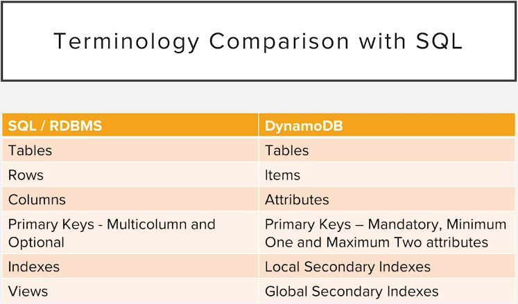

# DynamoDB Intro

## Types of NoSQL DBs
* **Columnar DBs** - column orientated. Optimized for reading and writing
  columns of data as opposed to rows of data (relational DB). Great for things like data
  warehousing and analytics. Reduces the overall disc I/O requirements and
  the amount of data that needs to be loaded from the disc. Some examples are
  Apache Casandra, Apache HBase, Amazon Redshift.
* **Key-value store** - data stored in key-value pairs. Optimized for read-heavy
  application workloads. Ex. social networking, gaming, media sharing applications.
  They are also suitable for compute-heavy workloads like recommendation engines.
  These DBs often leverage in-memory caching to improve application performance
  by storing critical pieces of data in memory and that allows for faster access.
  Examples are Redis, Couchbase Server, Memcached, DynamoDB.
* **Graph DBs** - good for exploring data that is structured like a graph or
  a tree for example. We have nodes and these nodes have relationships with
  other nodes through edges. These are used for huge data sets like social
  networking sites where everything is related. Some examples are Neo4j,
  OrientDB, GraphDB.
* **Document DBs** - store semi-structured data as documents. Typically JSON
  or XML documents. Some examples are Cassandra, Couchbase, MongoDB, DynamoDB.

DynamoDB is a key-value store, as well as a Document DB. It also supports
API operations in JSON format. DynamoDB does not actually store the data
in JSON format, but for all practical purposes, applications interact with
DynamoDB using the JSON format.

DynamoDB is
* Serverless - you do not have to manage the servers or any infrastructure
  to use DynamoDB.
* A Cloud DB - Available in AWS
* NoSQL - built for big data
* Fast - High throughput with low latency. Can be further improved by using
  DACS.
* Flexible - can store unstructured data
* Cost-effective - pay on the capacity that you provision for each table
* Highly scalable - can scale to demand
* Fault-tolerant - automatically replicates to multiple AZs, supports cross
  region replication.
* Secure - has fine-grained access control.

A table in DynamoDB is a grouping of records that conceptually belong together.
In a relational DB a table contains one entity, in DynamoDB it contains all the entities.
This helps to avoid the join operation, which is expensive as a DB scales.

A relational DB has a specified schema, that describes and enforces the shape of each
record in the table. At the DB level, DynamoDB is schemaless. You have to enforce a
schema in your application code.

An item is a single record in a DynamoDB table. Same as a row in a relational DB.

A dynamoDB item is made up of attributes, which are typed data values holding info
about the element. Attributes are similar to column values on relational records, except
not required.