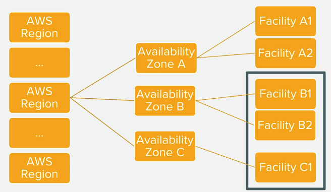
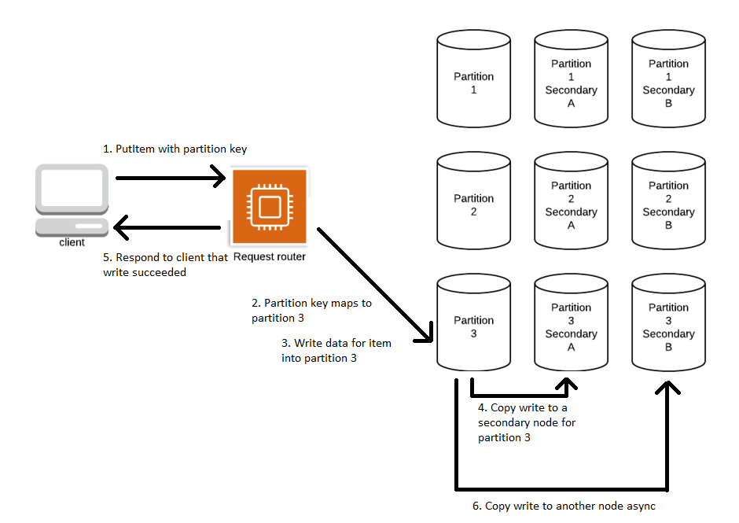

# DynamoDB Consistency Model
DynamoDB automatically replicates your data between multiple facilities.
DynamoDB stores your data on at least 3 copies of high speed SSDs located
in three different facilities within the region.

When we write to one of our DBs, then that data is eventually replicated
to the other facilities. This usually happens within 1-2 seconds. If you
are instantly reading the data as well, then that means that the data might
not be up-to-date, as the data has not been synchronized across all facilities.
When a request comes in, then it will hit one of the facilities.

Considering that time constraint, DynamoDB supports two types of reader
operations - strongly consistent reads and eventually consistent reads.

Strong consistency:
* The most up-to-date data
* Must be requested explicitly

Eventual consistency:
* May or may not reflect the latest copy of data. Provides you with data
  from one of its facilities. Not reflecting the actual data would happen
  only if the data was written in the last second or so.
* Default consistency for all operations
* 50% cheaper

Most applications, most of the time, should be fine with eventual consistency.

### Consistency
At a general level, consistency refers to whether a particular read operation
receives all write operations that have occurred prior to the read.

When you write data to DynamoDB, there is a request router that is the frontend for
all requests. It will authenticate your request to ensure you have access to write
to the table. If so, it will hash the partition key of your item and send that key
to the proper primary node for that item.

The primary node for a partition holds the canonical, correct data for the items
in that node. When a write request comes in, the primary node will commit the write
and commit the write to one of two secondary nodes for the partition. This ensures
the write is saved in the event of a loss of a single node.

After the primary node responds to the client to indicate that the write was
successful, it then asynchronously replicates the write to a third storage node.

The secondary nodes provide fault-tolerance, and distributed load for read requests.
The reads, however, can be eventually consistent, because the write replication happens
async.

So the order of operations
1. PutItem is called by the client with a given partition key
2. The partition key is found to map to partition X
3. Write data for item to partition X
4. Copy write to a secondary node for partition X
5. Respond to client that write succeeded
6. Copy write to another node async

The two types of consistency in Dynamo are
* Strong consistency
  * Any read will reflect all writes that happened beforehand
  * Consumes more read capacity
* Eventual consistency
  * Reads may be slightly outdated
  * Consumes less read capacity

Dynamo defaults to eventual consistency. Can opt into strong consistency via an
API parameter when performing your read.

Should consider your needs when choosing your indexes as well. A local secondary
index allows for strongly-consistent reads, just like the underlying table. A
global secondary index allows only eventually-consistent reads.