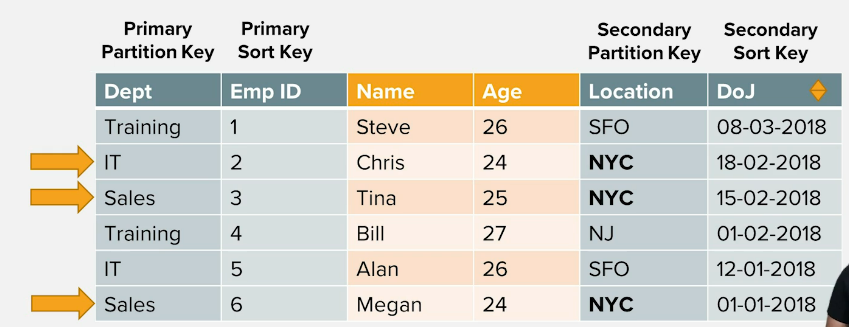

# DynamoDB Indexes

It is good to have a string as a partition key, but not required. Also, it's
good to have a number as a sort key, but again, not required.

Since local secondary indexes can only be defined on create time, then it's
good to spend a considerable amount of time thinking about what use cases
would be required.

## Primary key
Each item in a table is uniquely identified by a primary key.
The primary key definition must be defined at the creation of the table, and
then primary key must be provided when inserting a new item.

There are two types of primary key:
* a **simple primary key** made up of just a partition key. Similar to accessing
  rows in a SQL table by a primary key. Ex. get a row from a Users table with
  a username, which is the primary key.
* a **composite primary key** made up of a partition key and a sort/range key. The sort key
  is used to sort items with the same partition. Ex. Orders table for
  recording customers on an e-commerce site. The partition key would be the
  CustomerId, and the sort key would be the OrderId. The composite primary key
  enables sophisticated query patterns, including
  grabbing all items with the given partition key or using the sort key to
  narrow the relevant items for a particular query.

Each item in a table is uniquely identified by a primary key, even with
the composite key. When using a table with a composite primary key, you
may have multiple items with the same partition key, but different sort
keys. You can only have one item with a particular combination of partition
key and sort key.

The partition key is used to decide which partition the entry should go in.
A hashing function is run on the key and based on that hash a partition is
chosen.

In DynamoDB there is no way to query data without specifying the partition
key.

You can also perform scan operations that do not require you to specify
partition keys. This is, however, not recommended, unless really necessary.
Operations such as these, in most cases, indicate insufficient data modeling.

## Secondary Indexes
When creating a secondary index, you will need to specify the key schema of your index.
The key schema is similar to the primary key of your table - you will state the partition
and sort key (if desired) for your secondary index that will drive your access patterns.

### Local secondary index
A local secondary index uses the same partition key as your table's primary key, but
a different sort key. This can be a nice fit when you are often filtering your data
by the same top-level property, but have access patterns to filter your dataset
further. The partition key can act as the top-level property, and the different sort
key arrangements will act as your more granular filters.

Local secondary indexes must be created when you create your table.
You cannot add a local secondary index later on. You can create up to
5 such local secondary indexes.

The RCUs and WCUs are shared with the local secondary indexes. You can
perform eventually consistent as well as strongly consistent queries
using these local secondary indexes.

### Global secondary index
If you'd want to get information that isn't related to the primary
partition key, then this could be used. You can choose any attributes you want
for your partition key and your sort key. Global secondary indexes are used much
more frequently with DynamoDB due to their flexibility. For example, in the table, we'd
want to get all the employees working in NYC and sorted by their date of
joining.

The partition key is different from that of the primary key. You can
define up to 5 of these as well. Unlike the local secondary indexes,
these can be created at any time.

Global secondary indexes are stored separately in their own partitions.
They have their own throughput capacity as well, so their RCUs and WCUs
are not shared with the base table. You can only perform eventually
consistent reads with global secondary indexes. Data is replicated from the core table
to global secondary indexes in an async manner. This means it's possible that the data
returned in your global secondary index does not reflect the latest writes in your main
table. The delay in replication from the main table to the global secondary indexes
is not large, but it may be something you need to account for in your application.

There is no uniqueness constraint with the global secondary index.

|                        | Key schema                                                  | Creation time                         | Consistency                                                                                                            |
|------------------------|-------------------------------------------------------------|---------------------------------------|------------------------------------------------------------------------------------------------------------------------|
| Local secondary index  | Must use same partition key as the base table               | Must be created when table is created | Eventual consistency by default. Can choose to receive strongly-consistent reads at a cost of higher throughput usage. |
| Global secondary index | May use any attribute from table as partition and sort keys | Can be created after the table exists | Eventual consistency only.                                                                                             |
