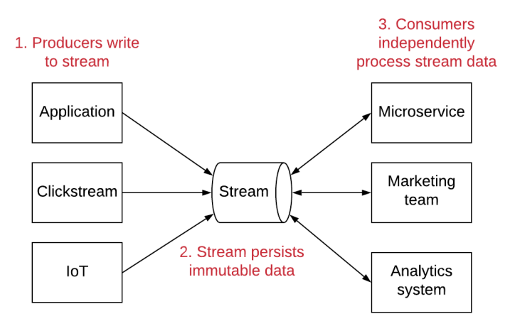
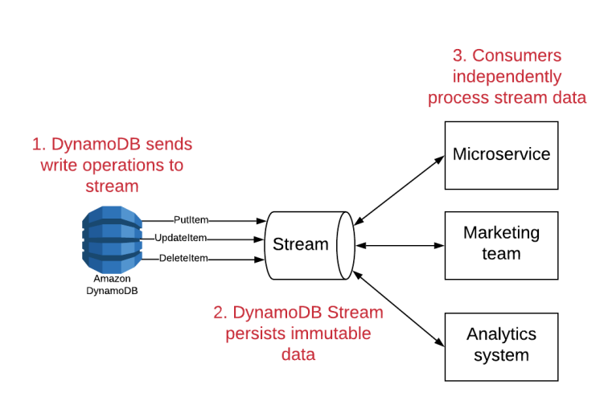

# DynamoDB Streams
Streams are an immutable sequence of records that can be processed by multiple,
independent consumers.

With DynamoDB streams, you can create a stream of data that includes a record of
each change to an item in your table. Whenever an item is written, updated, or
deleted, a record containing the details of that record will be written to your
DynamoDB stream. You can then process this stream with AWS Lambda or other compute
infrastructure.

# Time-to-live
TTLs allow you to have DynamoDB automatically delete items on a per-item basis.
This is a great option for storing short-term data in DynamoDB as you can use
TTL to clean up your database rather than handling it manually via a scheduled job.

To use TTL, you specify an attribute on your DynamoDB table that will serve as the
marker for item deletion. For each item that you want to expire, you should store a
Unix timestamp as a number in your specified attribute. This timestamp should state
the time after which the item should be deleted. DynamoDB will periodically review
your table and delete items that have your TTL attribute set to a time before the
current time.

For items that you don’t want to automatically expire, you can simply not set the
TTL attribute on the item.

Items are generally deleted in a timely manner, but AWS only states that items
will usually be deleted within 48 hours after the time indicated by the attribute.