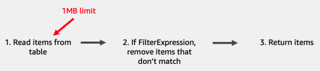

### Interacting with DynamoDB
When interacting with a relational DB, you'll often do so using SQL. In DynamoDB,
you usually do that using the AWS SDK, or a third party library in code.

There are basically three areas one can group the API actions into:
* Item-based actions - when you're operating on specific items
    * GetItem - used for reading a single item from a table
    * PutItem - used for writing an item to a table. This can completely overwrite an
      existing item with the same key, if any
    * UpdateItem - used for updating an item in a table. This can create a new item
      if it doesn't previously exist, or it can add, remove, or alter properties on an
      existing item.
    * DeleteItem - used for deleting an item from a table.
* Queries - operating on an item collection
* Scans - operating on an entire table

#### Item-based actions
There are three rules around item-based actions:
* The full primary key must be specified in your request
* All actions to alter data—writes, updates, or deletes—must use an item-based
  action.
* All item-based actions must be performed on your main table, not a secondary index.

You can't make a write operation to DynamoDB that says, "Update the attribute X for
all items with a partition key of Y" (assuming a composite primary key). You would
need to specify the full key of each of the items you’d like to update.

The above described single-item actions can be performed in batches and transactions.
These allow for multiple operations in a single request. But in here, still, you need
to specify the exact items on which to operate. The actions are split up in Dynamo, but
save you from sending multiple requests.

In a batch request, the actions can succeed and fail independently. So one write won't
affect another in the batch.

In a transactional request, it is all or nothing. If one fails, everything fails, causing
a rollback.

DynamoDB sets its limits to disallow writing queries that do not scale. You need a
partition key as that allows for a O(1) lookup. No matter how large your table
becomes, including a partition key makes it a constant time operation. With a
Query you can do >=, <=, begins_with(), between, but not contains(), ends_with().
This is because an item collection is ordered and stored as a B-tree. The time
complexity of a B-tree search is O(log n). Dynamo limits the data size so that you
wouldn't be querying too much at one time, thus keeping speed.

#### Query
A Query action lets you retrieve multiple items with the same partition key. Especially
useful when modeling and retrieving data that includes relations. We can add a condition
on the sort key.

#### Scan
A Scan can take a long time to run. It'll take everything. If you have a large table,
you'll have to paginate. You can consider using it if:
* You have a very small table
* You're exporting all data from your table to a different sytem
* In exceptional situations, where you have specifically modeled a sparse secondary
  index in a way that expects a scan.

#### Query structure
````ts
items = client.query(
  TableName='MoviesAndActors',
  KeyConditionExpression='#actor = :actor AND #movie BETWEEN :a AND :m',
  ExpressionAttributeNames={
    '#actor': 'Actor',
    '#movie': 'Movie'
  },
  ExpressionAttributeValues={
    ':actor': { 'S': 'Tom Hanks' },
    ':a': { 'S': 'A' },
    ':m': { 'S': 'M' }
  }
)
````

Expression attribute values - they start with a colon (:). They are substituted into the
KeyConditionExpression. This kind of structure simplifies parsing and validation the
expression, as typing is separated from the expression.

Expression attribute names - start with a bars character (#). Specify the names of
the attributes you are evaluating in your request. You are not required to use this,
but they come in handy when you might have a clash with reserved keywords. Also, when
you have a name with a period, as that would be interpreted as accessing a nested object.

Don't use an ODM (ORM equivalent). Fetching isn't straight-forward in Dynamo. It depends
heavily on your primary key design. Could use a helper library to translate the data
to objects, though, just not for queries.

You can provide additional optional properties to DynamoDB queries:
* ConsistentRead - set it to true to get a strongly-consistent read. It's available
  for GetItem, BatchGetItem, Query, Scan. Can only use on local secondary indexes, as
  all global ones are eventually consistent.
* ScanIndexForward - controls which direction you are reading the results from the
  sort key. Available on Query. Setting it to false reads it in descending order.
* ReturnValues - when performing a modification action, then you could get some
  attributes back using this. Usable on PutItem, UpdateItem, DeleteItem, TransactWriteItem.
  By default, Dynamo will not return any info for these operations. There are a couple
  of options for this property:
    * NONE - return no attributes. The default.
    * ALL_OLD - return all attributes as they were BEFORE the operation was applied.
    * UPDATED_OLD - any attributes that were updated, return them as they were BEFORE the operation.
    * ALL_NEW - return all as they are AFTER the operation.
    * UPDATED_NEW - any attributes AFTER the operation.
* ReturnConsumedCapacity - returns info on the capacity units used. Can use it when
  designing your table, for example, to see what access patterns consume how much. Could
  also pass the info onward to the customers that are billed based on the units.
* ReturnItemCollectionMetrics - item collections cannot be larger than 10 GB for a
  local secondary index. You can use this property to give advanced warnings.


#### AWS Management Console
This is the GUI for managing your data.
#### AWS CLI
The command line interface. Run `aws configure` first to set up your CLI.
#### AWS SDK
The `DocumentClient` class provides higher level access. Abstracts more away.
Easier to use for item level operations. Maps to appropriate data types.

When inserting items with the same ID, then the previous one will get replaced.

When doing a conditional write, and it fails, then a WCU is still consumed.

Atomic counters are counters that increment/decrement atomically. Atomic means
that it's independent of other similar operations. All requests are applied in order.
Not suitable for applications demanding high degree of accuracy.

When running a query, you are doing a direct lookup to a selected partition based on
primary or secondary partition/hash key.

Scan scans through the whole table looking for elements matching the criteria.

Query usually returns the results within a 100ms, whereas scan might even take a few
hours to find the relevant data.

#### Expressions
There are five types of expressions in DynamoDB:
* **Key condition expressions** - used in Query API calls to describe which items you
  want to retrieve in your query. Can only be used on elements of the primary key.
  You can use simple comparisons in your sort key conditions, such as greater than (>),
  less than (<), or equal to (=). `KeyConditionExpression="#c = :c AND #ot BETWEEN
  :start and :end"`. While you can use greater than, less than, equal to, or
  begins_with, every condition on the sort key can be expressed with the BETWEEN
  operator. Key expressions are critical when fetching multiple, heterogeneous
  items in a single request. With the right combination of item collection design and
  proper key expressions, you can essentially 'join' your data just like a relational
  database but without the performance impact of joins.
* **Filter expressions** - used in Query and Scan operations to describe which items
  should be returned to the client after finding items that match your key condition
  expression. The key difference with a filter expression vs. a key condition
  expression is that a filter expression can be applied on any attribute in the table,
  not just those in the primary key. `FilterExpression="#genre = :genre"`. The major
  drawback of this expression is that filtering is applied after querying all
  the items necessary. Filter expressions can save you a bit of data sent over the
  wire, but it won’t help you find data more quickly. It's also worth considering if
  you have a TTL field in your DB, then Amazon can take up to 48 hours to remove those
  entries, so it'd be safer to include that condition in your queries as well. Overall,
  don't rely on these too heavily.
  
* **Projection expressions** - used in all read operations to describe which attributes
  you want to return on items that were read.  A projection expression is similar to a
  filter expression in that its main utility is in reducing the amount of data sent
  over the wire in your response. While a filter expression works on an item-by-item
  basis, the projection expression works on an attribute-by-attribute basis within an
  item. `ProjectionExpression: "#actor, #movie, #role, #year, #genre"`. A projection
  expression is used to specify exactly the attributes you want to receive from the
  DynamoDB server. The projection expression can also be used to access nested
  properties, such as in a list or map attribute. Projection expressions are subject to
  the same caveats as filter expressions—they are evaluated after the items are read
  from the table and the 1MB limit is reached. Thus, if you are looking to
  fetch a large number of items but each of them has a large attribute, you may find
  yourself paginating more than you’d like. If this is the case, you may need to
  create a secondary index with a custom projection that only copies certain
  attributes into the index. This will allow you to quickly query multiple items
  without having to paginate due to large, unneeded attributes.
* **Condition expressions** - used in write operations to assert the existing condition
  (or non-condition) of an item before writing to it. Condition expressions are available
  on every operation where you will alter an item—PutItem, UpdateItem, DeleteItem, and
  their batch and transactional equivalents. They allow you to assert specific
  statements about the status of the item before performing the write operation. If
  the condition expression evaluates to false, the operation will be canceled.
  Condition expressions can operate on any attribute on your item, not just those in
  the primary key. This is because condition expressions are used with item-based
  actions where the item in question has already been identified by passing the key
  in a different parameter. Some reasons that you might want to use it are: do not
  overwrite using PutItem, prevent an UpdateItem from creating an invalid state,
  do not delete if the user is not the owner of an item. Without this property,
  you'd have to query before to check the conditions, and you would need to
  handle race conditions. In addition to the comparison operators, it has other
  functions that could be used:
    * attribute_exists() - check that an attribute exists
    * attribute_not_exists() - check that an attribute does not exist.
      `ConditionExpression: "attribute_not_exists(#username)",`
    * attribute_type() - check an attribute's type
    * begins_with() - value begins with a substring
    * contains() - a string contains a substring
    * size() - check an attribute's size. For a string it's the length, binary is the number
      of bytes. For Lists, maps, sets it returns the number of elements in a set.
      `ConditionExpression: "size(#inprogress) <= 10",`
* **Update expressions** - used in the UpdateItem call to describe the desired updates
  to an existing item. When using the UpdateItem API, you will only alter the
  properties you specify. If the item already exists in the table, the attributes
  that you don’t specify will remain the same as before the update operation. In an
  update expression, you need to state the changes you want to make. There are four
  verbs for stating these changes (`UpdateExpression="SET Name = :name, UpdatedAt = :updatedAt REMOVE InProgress"`):
    * SET: Used for adding or overwriting an attribute on an item. Can also be used
      to add or subtract from a number attribute
    * REMOVE: Used for deleting an attribute from an item or deleting nested
      properties from a list or map
    * ADD: Used for adding to a number attribute or inserting an element into a set
      attribute
    * DELETE: Used for removing an element from a set attribute


Key condition expressions, filter expressions, and projection expressions are used
for read operations.

Condition expressions is for all write-based operations.

Update expressions is for update operations only.

All expressions may use the expression attribute names
(`ExpressionAttributeNames={
"#a": "Actor"
}`) and all expressions other
than the projection expression must use expression attribute values
(`ExpressionAttributeValues={
":a": { "S": "Natalie Portman" }
}`).

Condition expressions can be used for checks across multiple items. If you want to
perform an action on a certain entity, but you do not have all the data needed
to decide whether to perform that action on the entity, then you can bind multiple
items together in a transaction and if a previous action fails, then the entire
thing fails. The TransactWriteItem API allows you to use up to 10 items in a
single request. The below example first checks that the user is an admin account.
If so, then perform a delete.
```js
result = dynamodb.transact_write_items(
  TransactItems=[
    {
      "ConditionCheck": {
        "Key": {
          "PK": { "S": "Admins#<orgId>" }
        },
        "TableName": "SaasApp",
        ConditionExpression: "contains(#a, :user)",
        ExpressionAttributeNames={
            "#a": "Admins"
        },
        ExpressionAttributeValues={
            ":user": { "S": <username> }
        }
      }
    },
    {
      "Delete": {
        "Key": {
            "PK": { "S": "Billing#<orgId>" }
        },
        "TableName": "SaasApp"
      }
    }
  ]
}
```