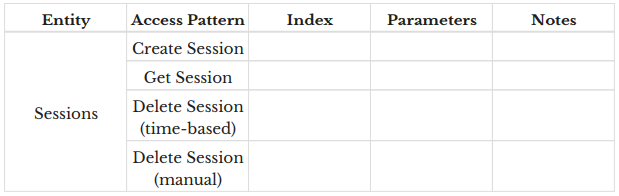
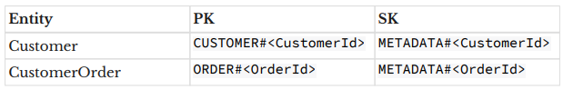

# Data modeling intro
It’s a bad idea to model your data in DynamoDB the same way you model your data in
a relational database.

In a relational database, you use the JOIN operator to connect data from different
tables in your query. Joins are inefficient at scale, and DynamoDB is built for
scale. Rather than reassembling your data at read time with a join, you should
preassemble your data in the exact shape that is needed for a read operation.

'Normalization' is basically the database version of the popular code mantra of
"Don’t Repeat Yourself" (or, "DRY"). If you have data that is duplicated across
records in a table, you should split the record out into a separate table and
refer to that record from your original table.

Normalization is on a spectrum, and you go to increasingly higher 'forms' of
normalization. This goes from first normal form (1NF) and second normal form (2NF)
all the way to sixth normal form (6NF), with a few unnumbered forms like elementary
key normal form (EKNF) in between.

1NF - all column values must be atomic, meaning they have a single value.

2NF - all non-key values must depend on the whole key. Non-key values cannot
depend on just part of the key.  Second Normal Form applies to relations with
composite keys, that is, relations with a primary key composed of two or more
attributes. A relation with a single-attribute primary key is automatically in
at least 2NF.

3NF - two columns on the table must be independent of each other. All non-key
attributes depend on only the primary key.

Normalization requires joins, as you need to reassemble your normalized records.
For Dynamo, you need to get comfortable denormalizing your data.

There are two reason for normalization:
1. Saving space by cutting duplication - this is no longer applicable, as storage is
   cheap
2. Maintaining data integrity - applies, and it's an application concern in Dynamo.

Due to the lack of joins, you will have multiple entities in a single Dynamo table.
If you want both Customers and CustomerItems in a single join, then you'll have to
design your primary key such that it can be done. Due to this, you wouldn't be able
to give descriptive names to your PK attributes.

In a relation DB, you have the WHERE clause for filtering and this allows for whatever
type of access. A WHERE clause needs to read and discard a large number of records,
and this is wasted compute. Thus, it is not usable at scale. Filtering with
DynamoDB is much more limited and, as a result, much more performant. The primary
keys of your table and your secondary indexes determine how you retrieve data.

The DynamoDB approach requires more planning and work upfront but will provide
long-term benefits as it scales.

The steps for modeling data in DynamoDB are:
* Understand your application
* Create an entity-relationship diagram ("ERD")
* Write out all of your access patterns
* Model your primary key structure
* Satisfy additional access patterns with secondary indexes and streams

Data modeling in DynamoDB is driven entirely by your access patterns. You will
not be able to model your data in a generic way that allows for flexible access
in the future. You must shape your data to fit the access patterns.

When using a relational database, you can usually just ship your ERD straight to
the database. Your entities become tables, and your relationships are configured
via foreign keys. You design your data in a way that can accommodate flexible
query patterns in the future

This is not the case when data modeling in DynamoDB. You design your data to
handle the specific access patterns you have, rather than designing for
flexibility in the future.

Talk with your PM, engineering manager, business analyst, and other stakeholders
in your application. Make sure you know all  the needs you have before you start
designing your table.

There are two different strategies you can use for building these access patterns:
* API-centric approach - common when implementing a REST API. You list out all the
  API endpoints you'll support, as well as the shape you'll return in your response.
* UI-centric approach - common for server-side rendering, or backends-for-frontends.
  Look at each of the screens and the URLs that will match those screens. Identify
  bits of information you need to assemble to build out the screens. Those become your
  access patterns.

Describing your access patterns is the most important step. You can handle almost
any data model with DynamoDB provided that you design for your access patterns up
front. The biggest problem users face is failing to account for their
patterns up front, then finding themselves stuck once their data model has
solidified.

When modeling your primary key, first create an entity chart. Copy all the
entities from your ERD into your table.

As you build out your data model, the rows in your entity chart may change. You
may remove entities that appear in your ERD because they aren’t tracked as
separate items in DynamoDB. For example, you may use a list or map attribute type
to represent related objects on a particular item. This denormalized approach
means there’s not a separate item for each of the related entities.

Additionally, you may need to add entities to your chart as you
design your table. A common example here is with a many-to-many relationship where
you need to add an item type to represent the relationship between entities. You
could also add an item type solely to ensure uniqueness on a particular attribute
for an item type.

After deciding the entities and relationships to model, the second step is to
decide on a simple or composite primary key. Most complex data models use a
composite primary key but there are exceptions. In general, a rule of thumb is
that if you have any access patterns that require retrieving multiple entities
(e.g., Get all Orders for a User) or entity types (e.g., Get a Sensor and the
most recent SensorReadings for the Sensor), you will need a composite primary key.

The last step is to start designing the primary key format for each entity type.
Make sure you satisfy the uniqueness requirements first. If you have some
additional flexibility in your key design after handling uniqueness, try to solve
some "fetch many" access patterns you have.

There’s no one-size-fits-all approach to designing your primary key, but there are
a few principles you should keep in mind:
* Consider what your client will know at read time - the client must know the
  primary key at read time or otherwise make costly additional queries to figure it out.
  For example, if the URL to fetch a particular user is
  `https://api.mydomain.com/users/alexdebrie`, where `alexdebrie` is the username,
  you can safely include username in the primary key as the username will be
  available on the API request. A common anti-pattern is to add a CreatedAt
  timestamp into their primary key. This will help to ensure the primary key for
  your item is unique, but will that timestamp be available when you need to
  retrieve or update that item? If not, use something that will be available or
  find how you will make this information available to the client.
* Use primary key prefixes to distinguish between entity types - can help identifying
  the types of entities. As you’re modeling your entities, keep track of primary key
  templates in your entity chart as shown below:
  

Once you’ve modeled your primary keys, you should see a bunch of access patterns
fall into place. And that’s great! It’s best to do as much as you can with your
primary keys. You won’t need to pay for additional throughput, and you won’t need
to consider eventual consistency issues that come with global secondary indexes.

You won’t always be able to model everything with your primary key. That’s where
you start thinking about secondary indexes. Secondary indexes are a powerful tool
for enabling additional read patterns on your DynamoDB table.

New users often want to add a secondary index for each read pattern. This is
overkill and will cost more. Instead, you can overload your secondary indexes
just like you overload your primary key. Use generic attribute names like
`GSI1PK` and `GSI1SK` for your secondary indexes and handle multiple access
patterns within a single secondary index.

## Single table design
In Dynamo, you should use as few tables as possible. Preferably one.

With multiple tables, you'd have to join by doing multiple network requests. This
would have to happen in a waterfall manner, thus you have to wait on each request, take
the data from a previous one and feed it into the next. As you scale, it becomes
slower and slower.

You can pre-join your data in Dynamo to avoid multiple requests. An item collection
in DynamoDB refers to all the items in a table or index that share a partition key.

A single table also saves on operational overhead as you don't need alarms for multiple
tables, just the one. Additionally, there's cost savings.

There are 3 main downsides to single-table design in Dynamo:
* The steep learning curve to understand single-table design.
* The inflexibility of adding new access patterns - If your access patterns change
  because you’re adding new objects or accessing multiple objects in different ways,
  you may need to do an ETL process to scan every item in your table and update with
  new attributes. This process isn’t impossible, but it does add friction to your
  development process. However, migrations aren’t to be feared.
* The difficulty of exporting your tables for analytics - DynamoDB is designed for
  on-line transactional processing (OLTP). But users also have a need for on-line
  analytics processing (OLAP). DynamoDB is not good at OLAP queries. DynamoDB
  focuses on being ultra-performant at OLTP queries and wants you to use other,
  purpose-built databases for OLAP. To do this, you’ll need to get your data from
  DynamoDB into another system. A well-optimized single-table DynamoDB layout looks
  more like machine code than a simple spreadsheet

When not to use a single-table design? Whenever I need query flexibility and/or
easier analytics more than I need blazing fast performance. There are two main
occasions where this is needed:
* in new applications where developer agility is more important than application
  performance;
* in applications using GraphQL.

If you’re making a greenfield application at a startup, it’s unlikely you
absolutely require the scaling capabilities of DynamoDB to start, and you may not
know how your application will evolve over time.

If your application is fine with 100ms response times, the increased flexibility
and easier analytics for early-stage use cases might be worth the slower
performance.

## Implementing the model
90% of the work of using DynamoDB happens in the planning stage, before you write a
single line of code.

When writing the code, then certain guidelines should be followed.

Separate application attributes from your indexing attributes. Even if an attribute's
value is encoded in the indexing attribute already, then don't remove that attribute
from the entity. E.g. username is used in the PK, and also in an attribute called
username. Duplicate it rather than relying on the PK.

Implement your data model at the very boundary of your application. DynamoDB objects
have type encodings that makes it difficult to work with those objects in the
business logic code. Transform the Dynamo objects to regular objects at the edge
of your app.

Don't reuse attributes across multiple indexes. You may have values that happen to
be the same for a global secondary index SK and the primary key SK. Do not reuse
these. It will make data modeling more difficult.
For each global secondary index you use, give it a generic name of
GSI<Number>. Then, use GSI<Number>PK and GSI<Number>SK for your attribute types.

Add a 'Type' attribute to every item. This attribute will be a simple string
declaring the type of entity: User, Order, SensorReading, etc. This can simplify
migrations. E.g. when you need you add extra properties to an entity, then you can
simply filter on that property. It also makes it easier to identity the entity type
when you're browsing the DB entries. Additionally, it can help when you're transforming
data for analytics.

Write scripts to help debug access patterns. Rather than use the DynamoDB console,
write little scripts that can be used to debug your access patterns.

Shorten attribute names to save storage. For the marginal application, the
additional attribute names won’t be a meaningful cost difference. However, if
you plan on storing billions and trillions of items in DynamoDB, this can make a
difference with storage.

## Strategies for data modeling
When modeling for a relational database, there’s basically one correct way to do
something. Every problem has a straightforward answer:
* Duplicating data? Normalize it by putting it into a separate table
* One-to-many relationship? Add a foreign key to indicate the relationship.
* Many-to-many relationship? Use a joining table to connect the two entities.

Data modeling with an RDBMS is like a science — if two people are modeling the same
application, they should come up with very similar patterns.

DynamoDB modeling is more art than science — two people modeling the same
application can have vastly different table designs.

Data modeling with DynamoDB requires flexibility, creativity, and persistence.
It can be frustrating, but it can also be a lot of fun.