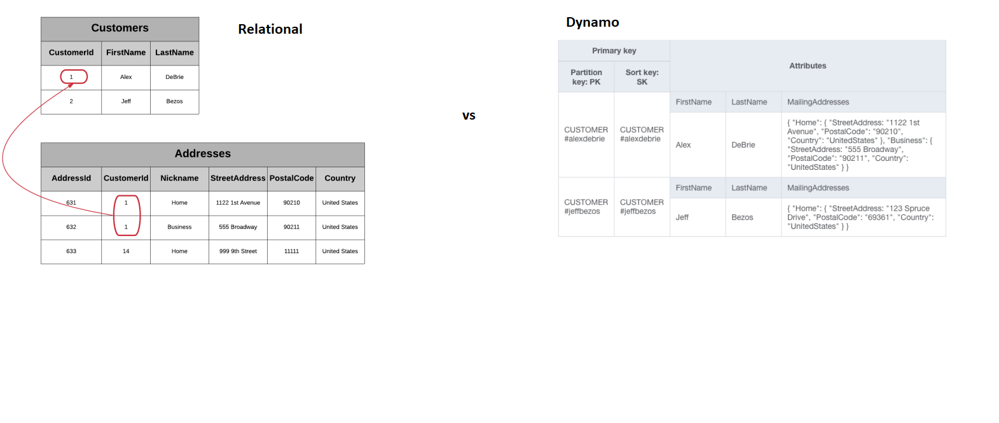
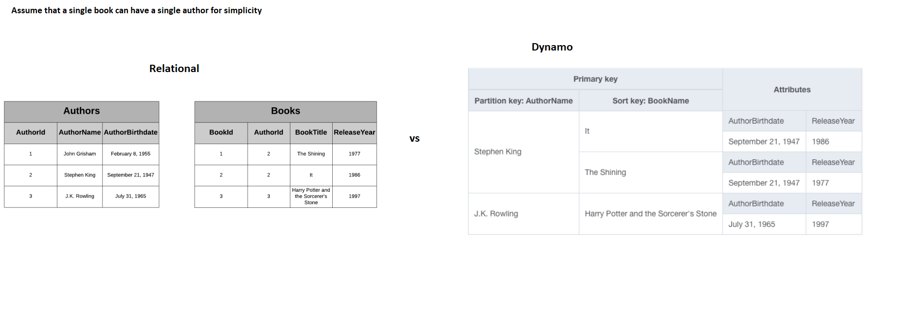
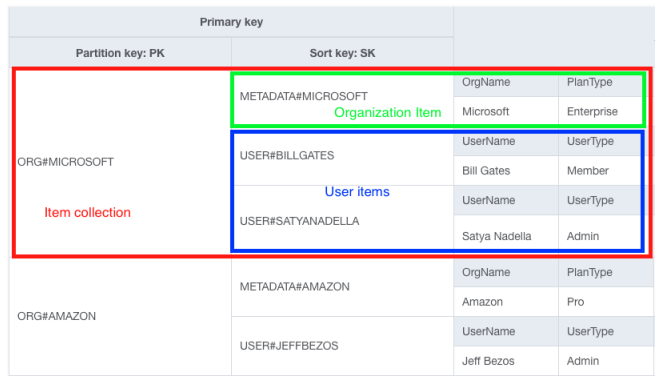
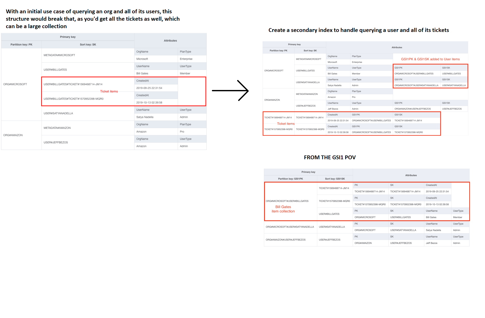
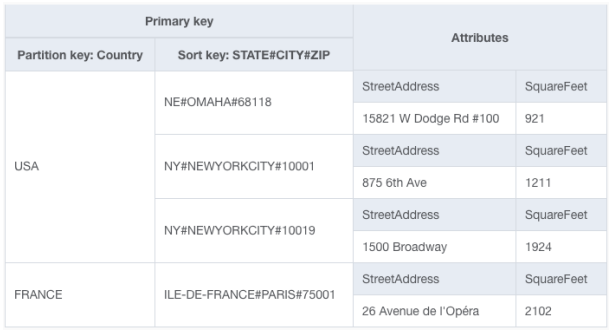

# One to many strategies

# Strategies for one-to-many relationships
A one-to-many relationship is when a particular object is the owner or source for
a number of sub-objects. E.g. a single office can have multiple employees.

With one-to-many relationships, there’s one core problem: how do I fetch
information about the parent entity when retrieving one or more of the related
entities?

In a relational database, there’s essentially one way to do this — using a
foreign key in one table to refer to a record in another table and using a SQL
join at query time to combine the two tables.

There are no joins in DynamoDB. Instead, there are a number of strategies for
one-to-many relationships, and the approach you take will depend on your needs.

## Denormalization by using a complex attribute

There are two factors to consider when deciding whether to handle a one-to-many
relationship by denormalizing with a complex attribute:
* Do you have any access patterns based on the values in the complex attribute?
    * All data access in DynamoDB is done via primary keys and secondary indexes.
      You cannot use a complex attribute like a list or a map in a primary key.
      Thus, you won’t be able to make queries based on the values in a complex
      attribute.
    * In the above example, we don’t have any access patterns like "Fetch a Customer
      by his or her mailing address". All use of the MailingAddress attribute will be
      in the context of a Customer, such as displaying the saved addresses on the
      order checkout page. Given these needs, it’s fine for us to save them in a
      complex attribute.

* Is the amount of data in the complex attribute unbounded?
    * A single DynamoDB item cannot exceed 400KB of data. If the amount of data that
      is contained in your complex attribute is potentially unbounded, it won’t be a
      good fit for denormalizing and keeping together on a single item.

## Denormalization by duplicating data
In a relational DB, if data is duplicated, it should be pulled out into a
separate table. Each record that uses that data should refer to it via a
foreign key reference.

Whenever we retrieve the Book, we will also get information about the parent
Author item.

There are two main questions you should ask when considering this strategy:
* Is the duplicated information immutable?
* If the data does change, how often does it change and how many items include the
  duplicated information?
    * Even if the data you’re duplicating does change, you still may decide to
      duplicate it. The big factors to consider are how often the data changes and
      how many items include the duplicated information. The more items the data is
      duplicated on, the greater the risk of data inconsistency.

Essentially, you’re balancing the benefit of duplication (in the form of faster
reads) against the costs of updating the data.

## Composite primary key + the Query API action

This primary key design makes it easy to solve four access patterns:
1. **Retrieve an Organization.** Use the GetItem API call and the Organization’s
   name to make a request for the item with a PK of ORG#<OrgName> and an SK of
   METADATA#<OrgName>.
2. _**Retrieve an Organization and all Users within the Organization.** Use the
   Query API action with a key condition expression of PK = ORG#<OrgName>. This would
   retrieve the Organization and all Users within it, as they all have the same
   partition key._
3. **Retrieve only the Users within an Organization.** Use the Query API action
   with a key condition expression of PK = ORG#<OrgName> AND begins_with(SK, "USER#").
   The use of the begins_with() function allows us to retrieve only the Users without
   fetching the Organization object as well.
4. **Retrieve a specific User.** If you know both the Organization name and the
   User’s username, you can use the GetItem API call with a PK of ORG#<OrgName> and
   an SK of USER#<Username> to fetch the User item.

The second example is most applicable as an example for this strategy. We’re
emulating a join operation in SQL by locating the parent object (the Organization)
in the same item collection as the related objects (the Users). We are pre-joining
our data by arranging them together at write time.

## Secondary index + the Query API action
This pattern is almost the same as the previous pattern, but it uses a secondary
index rather than the primary keys on the main table.

You may need to use this pattern instead of the previous pattern because the
primary keys in your table are reserved for another purpose.

In the example below, we want to add tickets that are related to the user.
We could utilize the primary key's sort key, but then that would mean that when
we query for the organization, then we also get all the tickets. Our access pattern
dictates that we want to get an organization with all of its users. The tickets
being related to the organization can massively blow the data up as there can be
many tickets.

Instead, we could create a secondary index to fulfill our needs. The access pattern
being that we need to query a user and all of its tickets. Can't use the primary key
for it, as we can't get a user using the partition key, so we go for a secondary index.

Looking at the data from the POV of GSI1, we can see that it's easy to query
a user and all of its related tickets.

## Composite sort keys with hierarchical data
In the last two strategies, we saw some data with a couple levels of hierarchy — an
Organization has Users, which create Tickets. But what if you have more than two
levels of hierarchy? You don’t want to keep adding secondary indexes to enable
arbitrary levels of fetching throughout your hierarchy.

You could encode information into your sort key to do this. This is called a composite
sort key. For example geographic data. You want to filter by country, state, city,
zip code. The country goes into the PK, and all the rest you put into the sort key.
`<STATE>#<CITY>#<ZIP_CODE>`

The patterns that could be used for the above are:
1. **Find all locations in a given country**. Use a Query with a key condition
   expression of PK = <Country>, where Country is the country you want.
2. **Find all locations in a given country and state**. Use a Query with a condition
   expression of PK = <Country> AND begins_with(SK, '<State>#'.
3. **Find all locations in a given country, state, and city**. Use a Query with a
   condition expression of PK = <Country> AND begins_with(SK, '<State>#<City>'.
4. **Find all locations in a given country, state, city, and zip code.** Use a
   Query with a condition expression of PK = <Country> AND
   begins_with(SK, '<State>#<City>#<ZipCode>'.

This composite sort key pattern won’t work for all scenarios, but it can be great
in the right situation. It works best when:
* You have many levels of hierarchy (>2), and you have access patterns for
  different levels within the hierarchy.
* When searching at a particular level in the hierarchy, you want all subitems in
  that level rather than just the items in that level. (A case where this wouldn't
  work is the previous example of tickets, as we do not want all the tickets.)

## Summary
| Strategy                        | Notes                                                                                                |
|---------------------------------|------------------------------------------------------------------------------------------------------|
| Denormalize + complex attribute | Good when nested objects are bounded and are not accessed directly                                   |
| Denormalize + duplicate         | Good when duplicated data is immutable or infrequently changing                                      |
| Primary key + Query API         | Most common. Good for multiple access patterns both the parent and related entities.                 |
| Secondary index + Query API     | Similar to primary key strategy. Good when primary key is needed for something else.                 |
| Composite sort key              | Good for deeply nested hierarchies where you need to search through multiple levels of the hierarchy |
