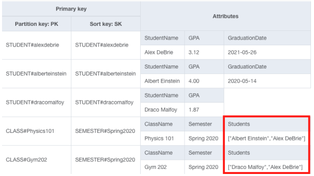
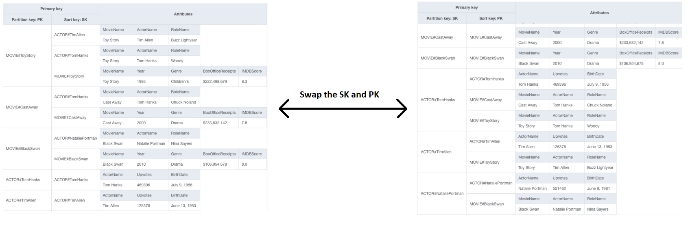
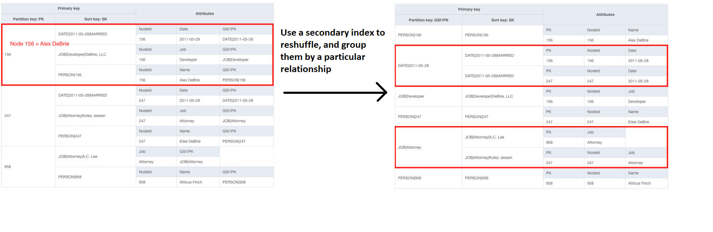
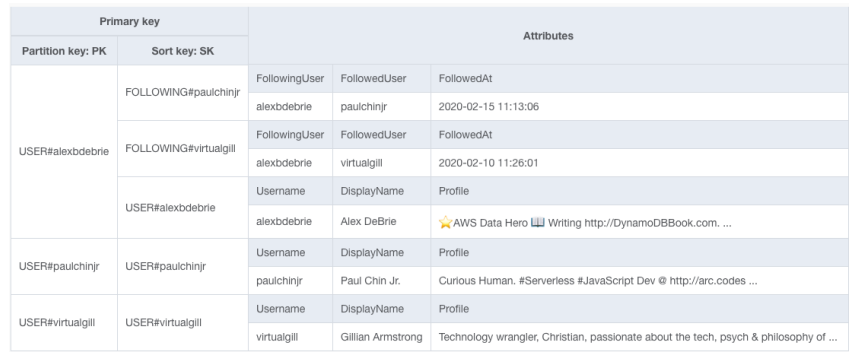

# Many-to-many strategies
A many-to-many relationship is one in which one type of object may belong to
multiple instances of a different type of object and vice versa. For example a student
can take multiple classes and a class can have multiple students.

Many-to-many relationships are tricky because you often want to query both
sides of the relationship.

In a relational database, you often handle this by using a linking table which
serves as an intermediary between your two objects.

#### Shallow duplication
Imagine classes and students. One of your access patterns is to fetch a class and
all the students in the class. However, when fetching information about a class,
you don’t need detailed information about each student in the class. You only need
a subset of information, such as a name or an ID.

To handle this, we could model our Class items so that information about the
students enrolled in the class would be duplicated into the item.

The shallow duplication strategy works when both of the following properties are
true:
1. **There is a limited number of related entities in the duplicated relationship.**
   DynamoDB items have a 400KB limit. Similar to the "denormalization with a complex
   attribute" strategy in the one-to-many relationship section, this will not work if
   there is a high or unlimited number of related entities that you need to maintain.
2. **The duplicated information is immutable.** This strategy works if the information
   that is duplicated does not change. If the information is frequently changing,
   you will spend a lot of time looking for all the references to the data and updating
   accordingly. This will result in additional write capacity needs and potential data
   integrity issues.

With this strategy, you take out one side of the many-to-many relationship, leaving
the other side to be a one-to-many.

#### Adjacency list
With this strategy, you model each top-level entity as an item in your table. You
also model the relationship between entities as an item in your table. Then, you
organize the items so that you can fetch both the top-level entity and information
about the relationship in a single request.

In the example below we have movies and actors as the top-level entities. They are
connected to each other via roles. So roles form the basis of a many-to-many relationship.

With one pattern, we can query a movie with all of its roles. When we flip the PK and SK
using a secondary index or a global secondary index, then we can query an actor with
all of their roles. The example uses a secondary index, instead of a global one.

You can combine mutable information with immutable information here. Ex. the movie
has a changing score, and the actor has changing upvotes. The mutable parts are
centralized.

This pattern works best when the information about the relationship between the two
is immutable. Ex. the role should not change.

You can use either a secondary index or a global secondary index for this pattern. If
you have other items in your table, in addition to the ones that model the relationship,
then you may not want to flip the PK and SK using a secondary index, as this may not
enable the access patterns you want. Could create a global secondary index instead
in which the PK and SK are flipped to allow for many-to-many in the items you care
about.

#### Materialized graph
A graph is made up of nodes and edges. Usually, a node is an object or concept, such
as a person, place, or thing. Various nodes are then connected via edges, which
indicate relationships between nodes. Ex. a person would be a node, a city would be
a node, and living there would be an edge.

The materialized graph pattern can be useful for highly-connected data that has a
variety of relationships. You can quickly find a particular type of entity and
all the entities that relate to it.

The graph on the left has all the different nodes being defined. They have properties
like being married, a job, person info. When the reshuffle happens using a secondary
index, then connections (edges) are formed. Node 156 and node 247 are connected with
one another by both being married on the same day.

The materialized graph pattern can be useful for highly-connected data that has a
variety of relationships. You can quickly find a particular type of entity and all
the entities that relate to it

#### Normalization and multiple requests
In the case of highly mutable and heavily duplicated data, then you'll probably have
to go with multiple requests for many-to-many. For example with Twitter you follow
people and people can follow you.

To get data from the above table you'd do two operations:
1. Use the Query API call to fetch the User item and the initial Following items
   to find information about the user and the first few users he’s following.
2. Use the BatchGetItem API call to fetch the detailed User items for each
   Following item that was found for the user. This will provide the authoritative
   information about the followed user, such as the display name and profile.

We’re making multiple requests to DynamoDB. However, there’s no better way to
handle it. If you have highly-mutable many-to-many relationships in DynamoDB,
you’ll likely need to make multiple requests at read time.

#### Conclusion
| Strategy                          | Notes                                                                               |
|-----------------------------------|-------------------------------------------------------------------------------------|
| Shallow duplication               | Good when a parent entity only needs minimal information about related entites      |
| Adjacency list                    | Good when information about the relationship is immutable or infrequently changing  |
| Materialized graph                | Good for highly interconnected data with a variety of relationships                 |
| Normalization & multiple requests | Fallback option for when you have highly-mutable data contained in the relationship |
