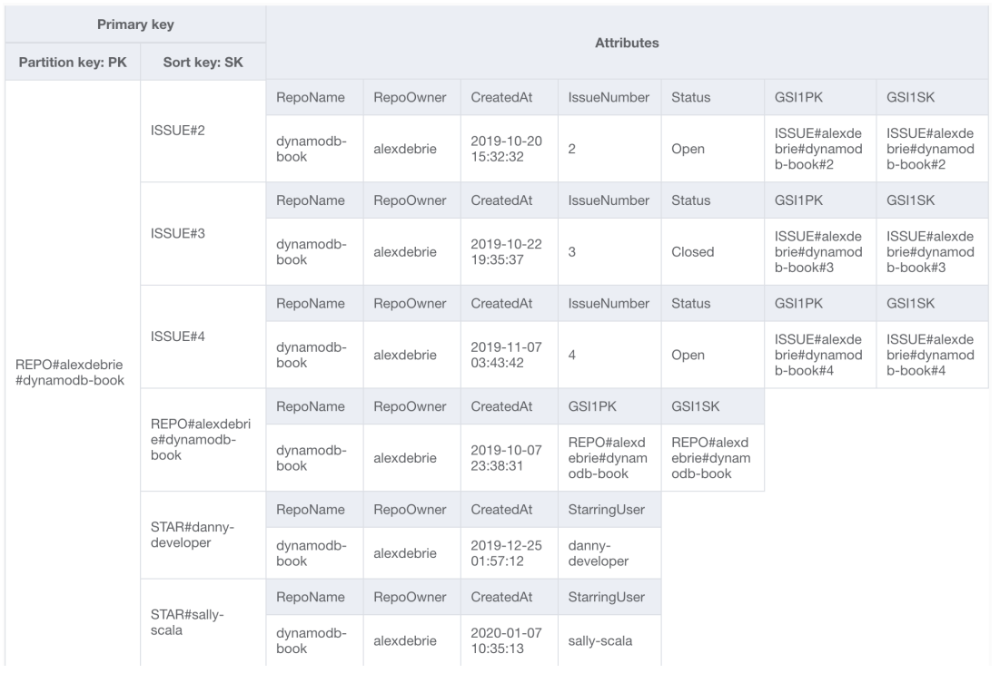
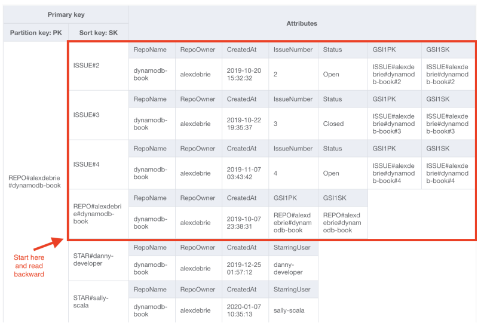
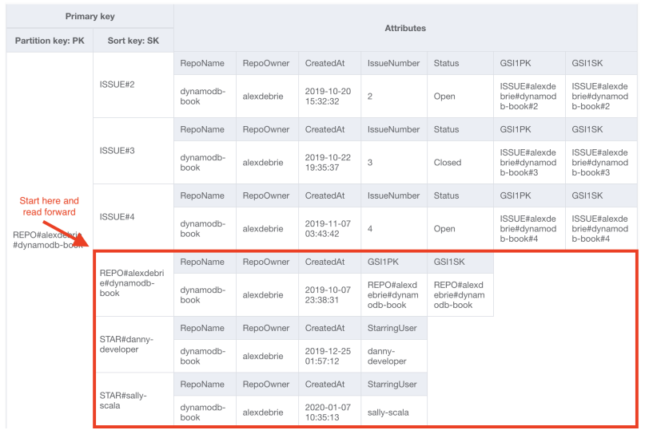
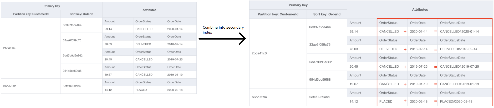
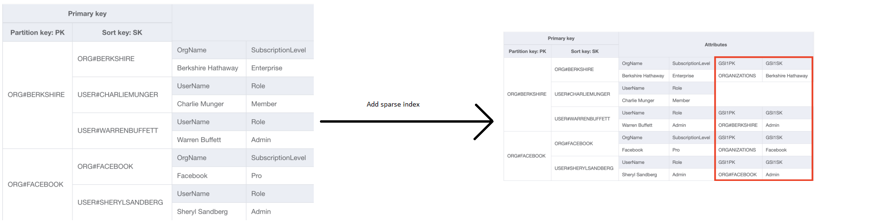
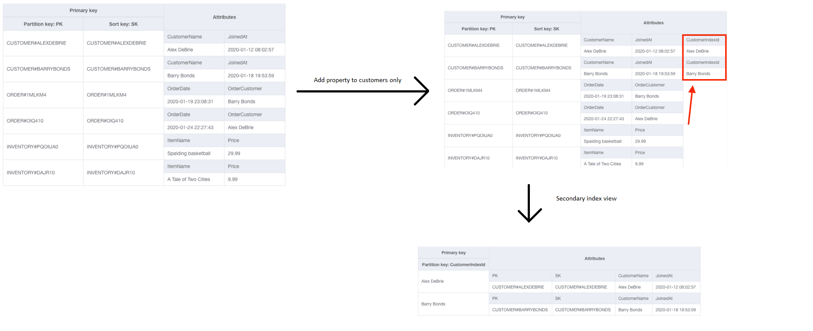

# Strategies for filtering
Database design is one giant exercise in filtering. How do you properly design your table so
that you get fast, consistent performance?

The key point one must understand is that filtering in DynamoDB is almost exclusively focused
on the primary key. One has to understand how to model, query, and index your primary keys
in order to get the most out of DynamoDB.

## Filtering with the partition key
The first and easiest way to filter data in DynamoDB is with the partition key of your
primary key. When a request is received by DynamoDB, it will hash the partition key to
find which storage node should be used to save or read the requested item.

The partition key has to be the starting point for your filtering. Other than the costly
Scan operation, all DynamoDB APIs require the partition key in the request. Make sure you
assemble items that are retrieved together in the same partition key.

## Filtering with the sort key
The second common filtering strategy is to add conditions on the sort key. This won’t
work when using a simple primary key as there is no sort key to speak of.

### Simple filters with the sort key
If you have a clear, simple item collection that’s grouped by a particular parent entity,
you can just use the sort key to filter on something inherently meaningful like dates or
scores.

The key point with this strategy is that the sort key itself is inherently meaningful.
For example, it shows a date, and you’re filtering within a certain date range.

In the blow example the CustomerId is the partition key and the OrderTime is the sort key.
```ts
result = dynamodb.query(
  TableName='CustomerOrders',
  KeyConditionExpression="#c = :c AND #ot BETWEEN :start and :end",
  ExpressionAttributeNames={
  "#c": "CustomerId",
  "#ot": "OrderTime"
  },
  ExpressionAttributeValues={
  ":c": { "S": "36ab55a589e4" },
  ":start": { "S": "2020-01-11T00:00:00.000000" },
  ":end": { "S": "2020-02-01T00:00:00.000000" }
  }
)
```

### Assembling different collections of items
The second pattern is slightly different in that the sort key also encodes some specific
information about how you’ve happened to arrange the data in your table.

Let's look at an example with Github.

Both Issues and Stars have a one-to-many relationship with Repos. Both Issues and Stars
have an access pattern where they want to retrieve the parent Repo item as well as a number
of related items (Issues or Stars).

To conserve on secondary indexes, we model all three of these items in the same item
collection.

The first three items in that table are Issue items, where the sort key pattern is
ISSUE#<IssueNumber>. Then there is a Repo item whose sort key is the same as the partition
key (REPO#alexdebrie/dynamodb-book). Finally, there are two Star items whose sort key
pattern is STAR#<Username>.



When we want to fetch the Repo item and all its Issue items, we need to add conditions on
the sort key so that we are filtering out the Star items. To do this, we’ll write a Query
like the following:

```ts
result = dynamodb.query(
  TableName='GitHubTable',
  KeyConditionExpression="#pk = :pk AND #sk <= :sk",
  ExpressionAttributeNames={
  "#pk": "PK",
  "#sk": "SK"
  },
  ExpressionAttributeValues={
  ":pk": { "S": "REPO#alexdebrie#dynamodb-book" },
  ":sk": { "S": "REPO#alexdebrie#dynamodb-book" }
  },
  ScanIndexForward=True
)
```

With the condition on the sort key value, we’re saying to only look for items whose sort
key is (alphabetically) less than or equal to REPO#alexdebrie#dynamodb-book.

Further, we’re using ScanIndexForward=True to read the items in descending order. This means
we’ll start at the Repo item and work backwards to remove all Star items from our query.



When you want to fetch a Repo and all of its Stars, you would use the opposite pattern:
assert that the sort key is greater than or equal to REPO#alexdebrie#dynamodb-book to
start at the Repo and work through the Star items.



The key difference between this pattern and the simple filtering pattern with the sort key
is that there’s no inherent meaning in the sort key values. Rather, the way that I’m sorting
is a function of how I decided to arrange my items within a particular item collection.

## Composite sort key
A third strategy for filtering in DynamoDB is to use a composite sort key. A composite sort
key is when you combine multiple data values in a sort key that allow you to filter on both
values.

An example would be an e-commerce site that has different statuses for orders. The UI allows
you to generate reports based on the status and date range, such as "Give me all
CANCELLED orders between July 1, 2018 and September 30, 2018".

For customers that have placed a lot of orders, this could be an expensive operation to
retrieve all orders and filter out the ones that don’t match. Rather than wasting a bunch of
read capacity, we can use a composite sort key to handle this complex pattern.

To do this, we first select our properties and then combine them into a secondary index sort
key. OrderStatus + OrderDate. CustomerId remains as the partition key.



Now we can use the Query API to quickly find what we want. To find all CANCELLED orders for
customer 2b5a41c0 between July 1, 2019 and September 30, 2019, you would write the following
query:

```ts
result = dynamodb.query(
  TableName='CustomerOrders',
  IndexName="OrderStatusDateGSI",
  KeyConditionExpression="#c = :c AND #osd BETWEEN :start and :end",
  ExpressionAttributeNames={
  "#c": "CustomerId",
  "#ot": "OrderStatusDate"
  },
  ExpressionAttributeValues={
  ":c": { "S": "2b5a41c0" },
  ":start": { "S": "CANCELLED#2019-07-01T00:00:00.000000" },
  ":end": { "S": "CANCELLED#2019-10-01T00:00:00.000000" },
  }
)
```

The composite sort key pattern works well when the following statements are true:
1. You always want to filter on two or more attributes in a particular access pattern.
2. One of the attributes is an enum-like value.

Considering these points and the above example, then we filtered on OrderStatus plus
OrderDate, which means the first property was true. Second, the OrderStatus attribute had a
limited set of potential values.

This pattern would not work in reverse. If you made your composite sort key to be
<OrderDate>#<OrderStatus>, the high cardinality of the OrderDate value would intersperse
items such that the OrderStatus property would be useless.

## Sparse indexes
When creating a secondary index, you will define a key schema for the index. When you write
an item into your base table, DynamoDB will copy that item into your secondary index if it
has the elements of the key schema for your secondary index. Crucially, if an item doesn't
have those elements, it won’t be copied into the secondary index.

A sparse index is one that intentionally excludes certain items from your table to help
satisfy a query

It is used in two main situations.

### Using sparse indexes to provide a global filter on an item type
The first example of using a sparse index is when you filter within an entity type based on
a particular condition.

Suppose we had a subscriptions table. We want to get all admins for an organization. With
a lot of users, we'd get a lot of read capacity expended and items discarded. To utilize a
sparse index here, we'd add an attribute to only those User items which have Administrator
privileges in their Organization.

To handle this, we’ll add GSI1PK and GSI1SK attributes to Organizations and Users. For
Organizations, we’ll use ORG#<OrgName> for both attributes. For Users, we’ll use
ORG#<OrgName> as the GSI1PK, and we’ll include Admin as the GSI1SK only if the user is an
administrator in the organization.



The key to note here is that we’re intentionally using a sparse index strategy to filter out
User items that are not Administrators. We can still use non-sparse index patterns for other
entity types.

### Using sparse indexes to project a single type of entity
For this we want to take a certain type of entity and have it be in a separate table.

For example, a marketing team would want to send emails to customers. Finding all the customers
would require a scan in this design. A secondary index is created from CustomerIndexId. Only
customers have that ID, so only they would be projected into the other index.



Now when the marketing department wants to find all Customers to send marketing emails, they
can run a **Scan** operation on the CustomerIndex, which is much more targeted and efficient.
By isolating all items of a particular type in the index, our sparse index makes finding all
items of that type much faster.

Again, notice that this strategy does not work with index overloading. With index overloading,
we’re using a secondary index to index different entity types in different ways. However,
this strategy relies on projecting only a single entity type into the secondary index.

## Filter expressions
Filter expressions seem powerful but are much more limited than they appear. This is because
a filter expression is applied after items are read, meaning you pay for all the items that
get filtered out, and you are subject to the 1MB results limit before your filter is
evaluated. Because of this, you cannot count on filter expressions to save a bad model.
Filter expressions are, at best, a way to slightly improve the performance of a data model
that already works well.

Filter expressions are useful in the following situations:
1. Reducing response payload size. DynamoDB can return up to 1MB in a single response.
   That's a lot of data to send over the wire, particularly if you’re just going to filter out
   a bunch of it once it’s returned. Server-side filtering can reduce the data transferred and
   speed up response times.
2. Easier application filtering. If you'll retrieve some results from DynamoDB and
   immediately run a filter() method to throw some away, it can be easier to handle than in
   your API request to DynamoDB. This is more of a personal preference.
3. Better validation around time-to-live (TTL) expiry. When using DynamoDB TTL, AWS states
   that items are generally deleted within 48 hours of their TTL expiry. This is a wide range!
   If you’re counting on expiration as a part of your business logic, you could get incorrect
   results. To help guard against this, you could write a filter expression that removes all
   items that should have been expired by now, even if they’re not quite expired yet.

For the first two examples, a filter expression can be considered an acceptable tactic with
at least a 30-40% hit rate on the filter OR if the total result size before the filter is
pretty small (definitely under 1MB and likely under a 100KB or so). If the hit rate is lower
than that, and you have a large result set, you’re wasting a ton of extra read capacity just
to throw it all away.

Reliance on filter expressions can make it more difficult to get a specific number of items.
For example, you want only SHIPPED orders. If you do it via a filter expression, then you
cannot really control it on Dynamo's side. If you do it via an index, then you can use the Limit
property, and you'll get the exact amount.

## Client-side filtering
With client-side filtering, you delay all filtering to the client rather than to DynamoDB.

Usages:
1. When filtering is difficult to model in the database
2. When the dataset isn’t that big.

An example for the first would be adding an appointment to a calendar. This can be a tricky
access pattern. It would be simpler to implement an algorithm in code.

Client-side filtering can be a great way to get some free compute without adding complexity
to your access patterns.

## Conclusion
| Strategy                         | Notes                                                                 | Relevant examples                             |
|----------------------------------|-----------------------------------------------------------------------|-----------------------------------------------|
| Filtering with the partition key | Good for initial segmentation of data into smaller groups             | All examples                                  |
| Filtering with the sort key      | Good for grabbing smaller subsets (e.g. timerange)                    | E-commerce orders                             |
| Composite sort key               | Good for filtering on multiple fields                                 | E-commerce filtering on order status and time |
| Sparse index                     | Good for providing a global filter on a set of data                   | Deals example                                 |
| Filter expressions               | Good for removing a few extraneous items from a narrow result set     | GitHub example                                |
| Client-side filtering            | Good for flexible filtering and sorting on a small (<1MB) set of data | Table views                                   |
