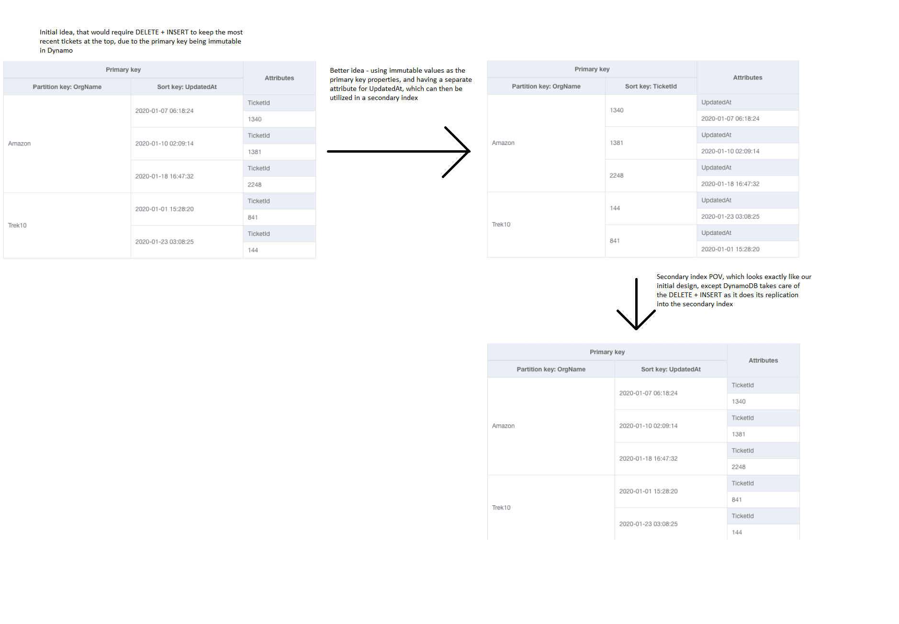
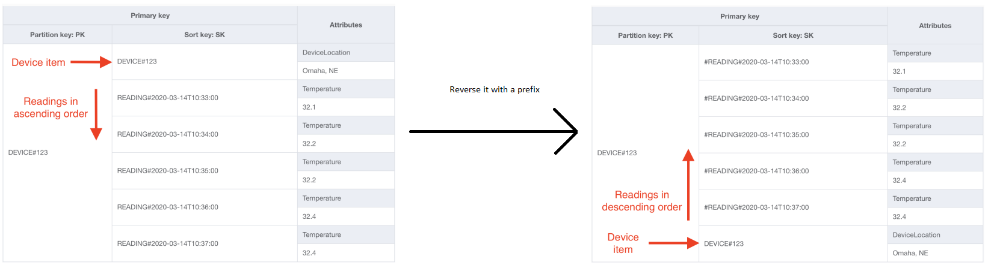
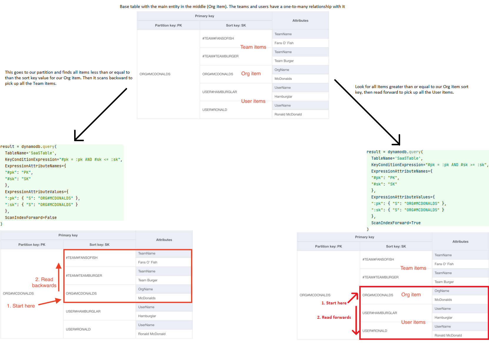
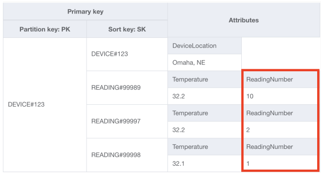

# Strategies for sorting
If you need to have specific ordering when retrieving multiple items in DynamoDB, there are
two main rules you need to follow. First, you must use a composite primary key. Second, all
ordering must be done with the sort key of a particular item collection.

In order to make DynamoDB efficient it follows certain ideas. First, it uses the partition
key to isolate item collections into different partitions and enables an O(1) lookup to
find the proper node. Then, items within an item collection are stored as a B-tree which
allow for O(log n) time complexity on search. This B-tree is arranged in lexicographical
order according to the sort key, and it’s what you’ll be using for sorting.

## Basics of sorting
Sorting happens only on the sort key. You can only use the scalar types of string, number,
and binary for a sort key.

For sort keys of type number, the sorting is exactly as you would expect—items are sorted
according to the value of the number.

For sort keys of type string or binary, they’re sorted in order of UTF-8 bytes.

### Lexicographical sorting
A simplified version of sorting on UTF-8 bytes is to say the ordering is lexicographical.
This order is basically dictionary order with two caveats:

1. All uppercase letters come before lowercase letters
2. Numbers and symbols (e.g. # or $) are relevant too.

In order to avoid unexpected behavior from the first rule, you should standardize your sort
key value. E.g. uppercase it all.

### Sorting with timestamps
Either epoch timestamps or ISO-8601 will do. What you absolutely cannot do is use something
that’s not sortable, such as a display-friendly format like "May 26, 1988".

### Unique, sortable IDs
A common need is to have unique, sortable IDs. This comes up when you need a unique
identifier for an item (and ideally a mechanism that’s URL-friendly) but you also want to
be able to sort a group of these items chronologically.

There are many options here, but one example is a KSUID. It’s a unique identifier that is
prefixed with a timestamp but also contains enough randomness to make collisions very
unlikely. In total, you get a 27-character string that is more unique than a UUIDv4 while
still retaining lexicographical sorting.

## Sorting on changing attributes
The sort key in DynamoDB is used for sorting items within a given item collection. This can
be great for a number of purposes, including viewing the most recently updated items or a
leaderboard of top scores. However, it can be tricky if the value you are sorting on is
frequently changing.

When updating an item in DynamoDB, you may not change any elements of the primary key. Thus,
if you have a changing attribute as the sort key in your primary key, then you have to delete
and insert each time the value changes.

Consider an example of a ticket system where we want the most recently updated tickets to be
at the top. For this you'd choose UpdatedAt as your sort key, but that means you have to delete
and insert on each change. Instead, we could have the UpdatedAt be a part of a secondary index.
That way, DynamoDB would keep the secondary index sorted as needed, and we wouldn't need to manage
the insertion and deletion logic.

We can use the Query API against our secondary index to satisfy our ‘Fetch most recently
updated tickets’ access pattern. More importantly, we don’t need to worry about complicated
delete + create logic when updating an item. We can rely on DynamoDB to handle that logic
when replicating the data into a secondary index.

## Ascending vs. descending
By default, DynamoDB will read items in ascending order. If you’re working with words, this
means starting at aardvark and going toward zebra. If you’re working with timestamps, this
means starting at the year 1900 and working toward the year 2020.

You can flip this by using ScanIndexForward=False, which means you’ll be reading items in
descending order. This is useful for a number of occasions, such as when you want to get the
most recent timestamps, or you want to find the highest scores on the leaderboard.

A complication arises for one-to-many access patterns. This is because in such access patterns
you are combining multiple entities and went to get the parent with its related items in one
item collection.

In such cases, you need to consider the common sort order, so you'd know how to place your
parent item.

When you are co-locating items for one-to-many or many-to-many relationships, be sure to consider the order in which you
want the related items returned so that your parent itself is located accordingly.

## Two relational access patterns in a single item collection
The previous example had related items before or after the main entity. But we could have a
situation where they're both before and after the main entity in one item collection.

You'll need to have one access pattern in which you fetch the related items in ascending
order and another access pattern where you fetch the related items in descending order. It
also works if order doesn't really matter for one of the two access patterns.

An example: Within an Organization, there are two sub-concepts: Users and Teams. Both Users
and Teams have a one-to-many relationship with Organizations. Consider the access pattern
"Fetch Organization and all {Users|Teams} for the Organization". Further, you want to fetch
Users in alphabetical order, but Teams can be returned in any order because there
shouldn't be that many of them.

Notice that the Org item is right between the Team items and the User items. We had to
specifically structure it this way using a # prefix to put the Team item ahead of the Org
item in our item collection.

This is a more advanced pattern that is by no means necessary, but it will save you
additional secondary indexes in your table.

## Zero-padding with numbers
You may occasionally want to order your items numerically even when the sort key type is a
string. A common example of this is when you’re using prefixes to indicate your item types.
Your sort key might be <ItemType>#<Number>. While this is doable, you need to be careful
about lexicographic sorting with numbers in strings. With lexicographic sorting 10 would be
ahead of 2, because 1 comes before 2.

To avoid the above described problem, you can pad your numbers with 0s. The big factor here
is to make sure your padding is big enough to account for any growth.

A recommendation would be going to the maximum number of related items you could ever imagine
someone having, then adding 2-3 digits beyond that. You may also want to have an alert
condition in your application code that lets you know if a particular count gets to more
than X% of your maximum, where X is probably 30 or so.

## Faking ascending order
This is a combination of previous ones. Imagine you had a parent entity that had two one-to-many
relationships. Both of those relationships use a number for identification, but you want to
fetch both of them in the same order (either descending or ascending).

You could have either two indexes or zero-padded difference and zero-padding combined. For
a zero-padded difference we subtract from the highest possible number our current number.
Ex. 99999 - 157 = 99842

The best takeaway you can get from this strategy is how flexible DynamoDB can be if you
combine multiple strategies. Once you learn the basics, you can glue them together in
unique ways to solve your problem.

## Conclusion
| Strategy                                                   | Notes                                                                                  | Relevant examples                   |
|------------------------------------------------------------|----------------------------------------------------------------------------------------|-------------------------------------|
| Using KSUIDs for sortable, unique IDs                      | Good for unique identifiers that still need sorted chronologically                     | GitHub migration example            |
| Sorting on changing attributes                             | Use secondary indexes to avoid delete + create workflow                                | Leaderboards; most recently updated |
| Ascending vs. descending                                   | Consider the order in which you’ll access items when modeling relations                | All relational examples             |
| Two relational access patterns in a single item collection | Save money on secondary indexes by reusing an item collection                          | GitHub migration                    |
| Zero-padding with numbers                                  | If sorting with integers, make sure to zero-pad if numbers are represented in a string | GitHub example                      |
