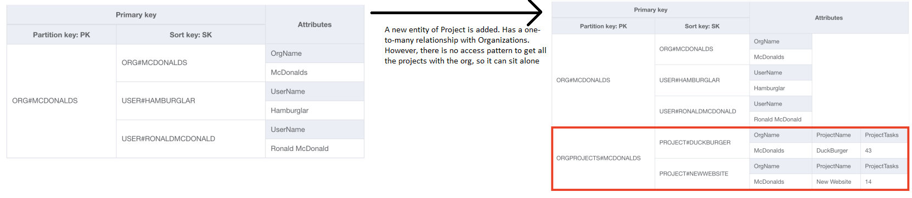
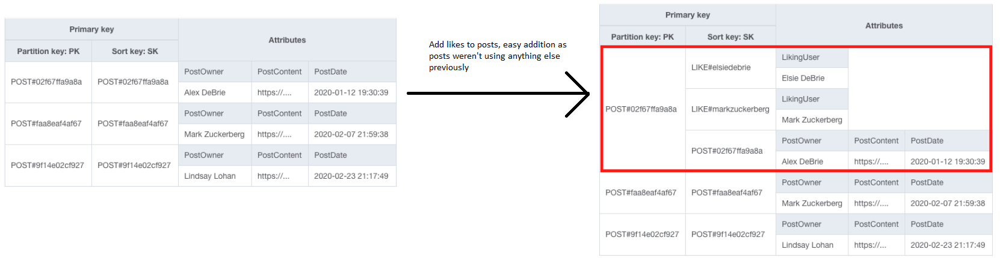
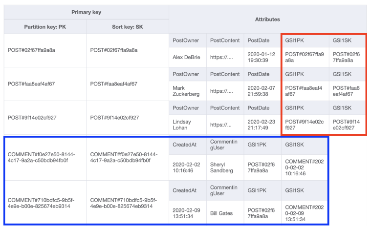

## Strategies for migrations
You need to model your DynamoDB table to match your access patterns. So what do you do when
your access patterns change? This chapter contains strategies on adding new access patterns
and migrating your data.

### Adding new attributes to an existing entity
The easiest type of migration is to add new attributes to existing entities.

When adding new attributes, you can simply add this in your application code without doing
any large scale ETL process on your DynamoDB database.

Adding application attributes is the easiest type of migration because you don’t really
think about application attributes while modeling your data in DynamoDB. You are primarily
concerned with the attributes that are used for indexing within DynamoDB. The schemaless
nature of DynamoDB makes it simple to add new attributes in your application without doing
large-scale migrations.

### Adding a new entity type without relations
Now, it’s rare that an entity won’t have any relations at all on your ERD for your
application. As Rick Houlihan says, all data is relational. It doesn't float around
independently out in the ether. This scenario is more about when you don’t have an
access pattern that needs to model a relation in DynamoDB.

Imagine you have a new type of nested item in a one-to-many relationship, but you don't
have any access patterns that are "Fetch the parent entity and its related entities".
In this case, you don’t need to worry about creating an item collection with an existing
entity. You can simply start writing your new entity type and handle those access
patterns directly.

We have a new entity type: Projects. A Project belongs to an Organization, and an
Organization can have multiple Projects. Thus, there is a one-to-many relationship
between Organizations and Projects.

When reviewing our access patterns, we have a "Get Projects for Organization" access
pattern, but we don't need to fetch the parent Organization item as part of it. Because
of that, we can model the Projects into a new item collection altogether.



All the Project items are in the same item collection as they share the same partition key,
but they aren't in the same item collection as any existing items. We didn't have to make
any changes to existing items to handle this new entity and its access patterns, so it's a
purely additive change. Like the addition of an attribute, you just update your application
code and move on.

### Adding a new entity type into an existing item collection
It's similar to the last one, but now there is an access pattern including the parent on it.

In this example, the parent entity is currently sitting alone, so it's an easy addition.



### Adding a new entity type into a new item collection
We don't have an existing item collection in this case.

Consider the same model as in the previous example, but now we have comments. Our access
pattern is getting the post and its comments. For this example, we'll use a global secondary
index.

The existing item needs to get the GSI properties filled and the new item will connect itself
to the parent entity using the GSI.



The biggest change here is adding GSI values to the existing posts. A full scan has to be run,
where each post object is updated with the GSIs.

We first filter out all the entities that are of the type that we care about - post.
We iterate over all of them and make an update_item request for them. Finally check if
we've gone over all of them.

```python
last_evaluated = ''
params = {
  "TableName": "SocialNetwork",
  "FilterExpression": "#type = :type",
  "ExpressionAttributeNames": {
    "#type": "Type"
  },
  "ExpressionAttributeValues": {
    ":type": { "S": "Post" }
  }
}
while True:
  # 1. Scan to find our items
  if last_evaluated:
    params['ExclusiveStartKey'] = last_evaluated
    
  results = client.scan(**params)
  
  # 2. For each item found, update with new attributes.
  for item in results['Items']:
    client.update_item(
      TableName='SocialNetwork',
      Key={
        'PK': item['PK'],
        'SK': item['SK']
      },
      UpdateExpression="SET #gsi1pk = :gsi1pk, #gsi1sk = :gsi1sk",
      ExpressionAttributeNames={
        '#gsi1pk': 'GSI1PK',
        '#gsi1sk': 'GSI1SK'
      }
      ExpressionAttributeValues={
        ':gsi1pk': item['PK'],
        ':gsi1sk': item['SK']
      }
    )
  # 3. Check to see if there are additional pages to process in Scan.
  if not results['LastEvaluatedKey']:
    break
  last_evaluated = results['LastEvaluatedKey']
```

There are a few things you’d want to do to make this better, including using parallel scans,
adding error handling, and updating multiple items in a BatchWriteItem request, but this is
the general shape of your ETL process.

This is the hardest part of a migration, and you’ll want to test your code thoroughly and
monitor the job carefully to ensure all goes well. However, there’s really not that much
going on. A lot of this can be parameterized:
* How do I know which items I want?
* Once I get my items, what new attributes do I need to add?

From there, you just need to take the time for the whole update operation to run.

### Joining existing items into a new item collection
This involves having a new access pattern on existing items.

The pattern here is similar to the last section. Find the items you want to update and
design an item collection in a new or existing secondary index. Then, run your script to
add the new attributes, so they’ll be added to the secondary index.

### Using parallel scans
DynamoDB makes parallel scans easy. When you’re doing a Scan operation, there are two
optional properties:
* Total Segments: This indicates the total number of segments you want to split your
  Scan across
* Segment: This indicates the segment to be scanned by this particular worker.

Considering the script example above, we'd only add these two properties to the scan to
make parallel scans works.
```python
params = {
  "TableName": "SocialNetwork",
  "FilterExpression": "#type = :type",
  "ExpressionAttributeNames": {
    "#type": "Type"
  },
  "ExpressionAttributeValues": {
    ":type": "Post"
  },
  "TotalSegments": 10,
  "Segment": 0
}
```

What that is saying is - I want to split my Scan across 10 workers, and this is worker 0
processing the table. I would have nine other workers processing segments 1 - 9 as well.

This will greatly speed up your ETL processing without adding a lot of complexity.
DynamoDB will handle all the state management for you to ensure every item is handled.

### Conclusion
| Situation                                            | Notes                                                                                  | Relevant examples                         |
|------------------------------------------------------|----------------------------------------------------------------------------------------|-------------------------------------------|
| Adding new attributes to existing entity             | Lazily add attributes                                                                  | GitHub Migration (Codes of Conduct)       |
| Adding a new entity without relations                | Write items to new item collection                                                     | SaaS table with Projects                  |
| Adding a new entity into an existing item collection | Model items to go to existing item collection                                          | GitHub Migration (Gists)                  |
| Adding a new entity into a new item collection       | Update existing items to add new attributes. Model new items into same item collection | GitHub Migration (Apps)                   |
| Joining existing items into a new item collection    | Update existing items to add new attributes.                                           | GitHub Migration (Issues & Pull Requests) |
