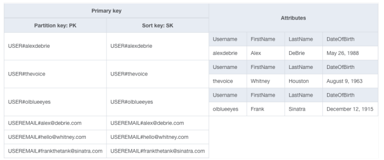
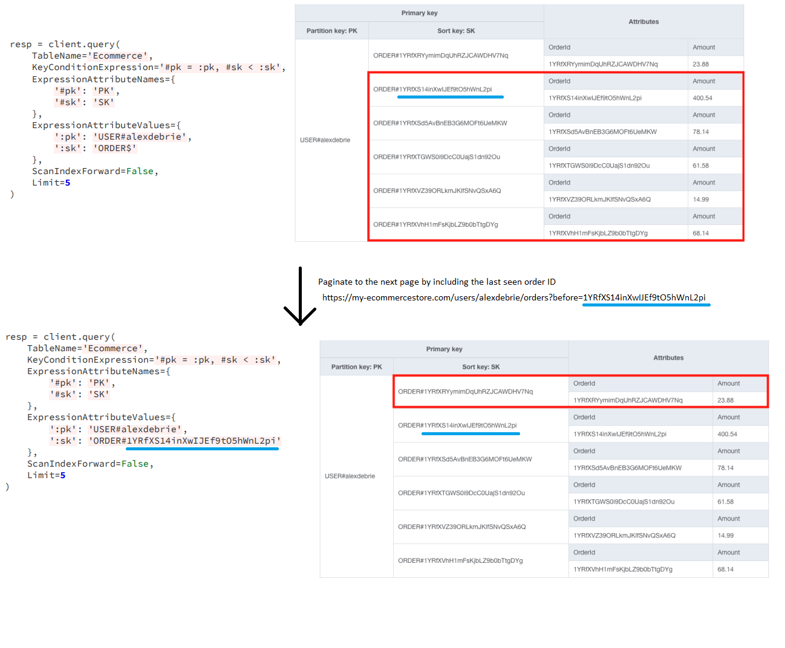
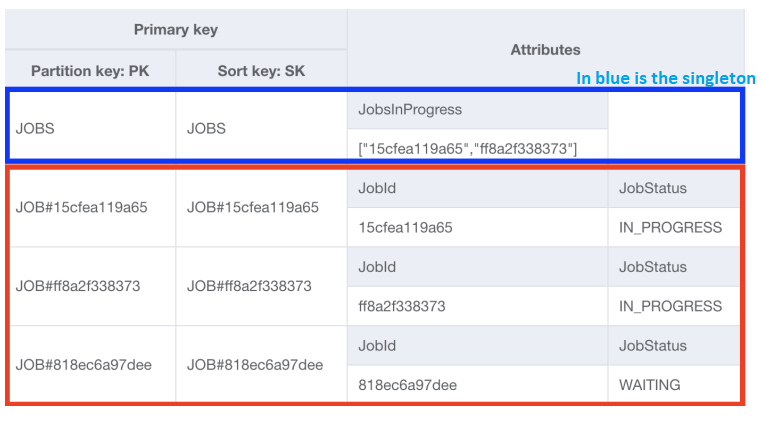

## Additional strategies
This includes strategies that don't fit into previous ones.

### Ensuring uniqueness on two or more attributes
In DynamoDB, if you want to ensure a particular attribute is unique, you need to build that
attribute directly into your primary key structure.

For this you can use a transaction. The example here is with guaranteeing email uniqueness,
as well as guaranteeing username uniqueness, which is the base requirement.

```python
response = client.transact_write_items(
  TransactItems=[
    {
      'Put': {
        'TableName': 'UsersTable',
        'Item': {
          'PK': { 'S': 'USER#alexdebrie' },
          'SK': { 'S': 'USER#alexdebrie' },
          'Username': { 'S': 'alexdebrie' },
          'FirstName': { 'S': 'Alex' },
          ...
        },
        'ConditionExpression': 'attribute_not_exists(PK)
      }
    },
    {
      'Put': {
        'TableName': 'UsersTable',
        'Item': {
          'PK': { 'S': 'USEREMAIL#alex@debrie.com' },
          'SK': { 'S': 'USEREMAIL#alex@debrie.com' },
        },
        'ConditionExpression': 'attribute_not_exists(PK)
      }
    }
  ]
)

```

For each write operation, we’re including a condition expression that ensures that an item
with that primary key doesn't exist. This confirms that the username is not currently in
use and that the email address is not in use.



If you need to access a user by email, then you need to duplicate all information across
both items.

### Handling sequential IDs
In relational database systems, you often use a sequential ID as a primary key identifier
for each row in a table. With DynamoDB, this is not the case. You use meaningful
identifiers, like usernames, product names, etc., as unique identifiers for your items.

However, sometimes there are user-facing reasons for using sequential identifiers.
Perhaps your users are creating entities, and it’s easiest to assign them sequential
identifiers to keep track of them.

Dynamo has no built-in method for sequential IDs, but we can make it work with a two-step
process. Let's consider it with a Jira example:
1. Run an `UpdateItem` operation on the Project item (base item) to increment the `IssueCount`
   (property that tracks how many sub-entities there are) attribute by 1. Also set the
   `ReturnValues` parameter to `UPDATED_NEW`, which will return the current value of all updated
   attributes in the operation.
2. We use the number to create our new issue.

```python
resp = client.update_item(
  TableName='JiraTable',
  Key={
    'PK': { 'S': 'PROJECT#my-project' },
    'SK': { 'S': 'PROJECT#my-project' }
  },
  UpdateExpression="SET #count = #count + :incr",
  ExpressionAttributeNames={
    "#count": "IssueCount",
  },
  ExpressionAttributeValues={
    ":incr": { "N": "1" }
  },
  ReturnValues='UPDATED_NEW'
)

current_count = resp['Attributes']['IssueCount']['N']

resp = client.put_item(
  TableName='JiraTable',
  Item={
    'PK': { 'S': 'PROJECT#my-project' },
    'SK': { 'S': f"ISSUE#{current_count}" },
    'IssueTitle': { 'S': 'Build DynamoDB data model' }
    ... other attributes ...
  }
)

```

First we increment the IssueCount on our Project item. Then we use the updated value in the
PutItem operation to create our Issue item.

This isn’t the best since you’re making two requests to DynamoDB in a single access pattern.
However, it can be a way to handle auto-incrementing IDs when you need them.

### Pagination
In a relational database, you may use a combination of `OFFSET` and `LIMIT` to handle
pagination. DynamoDB does pagination a little differently, but it’s pretty straightforward.

When talking about pagination with DynamoDB, you’re usually paginating within a single item
collection. You’re likely doing a Query operation within an item collection to fetch
multiple items at once.

We keep in mind what was the last entity ID that we saw and then we include that in the
next query to start querying from that.



### Singleton items
In most of the examples we have an item pattern that is re-used across multiple items. E.g.
`USER#<Username>`. If you want a singleton, then you simply remove the pattern and only
use the entity identifier. So `USER#<Username>` becomes simply `USER`.

Below is an example with jobs. We track the jobs in progress. When a new job goes into progress,
then we:
1. Update the `JobsInProgress` attribute of the singleton Jobs item to add the new Job ID to
   the set if the current length of the set is less than 100, the max number of jobs in progress.
2. Update the relevant Job item to set the status to `IN_PROGRESS`.



### Reference counts
With one-to-many or many-to-many relationships, there is often the need to display a
reference count on the frontend. E.g. number of likes, comments, retweets.

We could count the number of items, but that'd burn our read capacity.

Instead, we’ll keep a count of these related items as we go. Whenever we add a related
item, we usually want to do two things:
1. Ensure the related item doesn't already exist (e.g. this particular user hasn't already
   starred this repo);
2. Increase the reference count on the parent item.

Note that we only want to allow it to proceed if both portions succeed. This is a great case
for DynamoDB Transactions!

```python
result = dynamodb.transact_write_items(
  TransactItems=[
    {
    "Put": {
      "Item": {
        "PK": { "S": "REPO#alexdebrie#dynamodb-book" },
        "SK": { "S": "STAR#danny-developer" }
        ...rest of attributes ...
      },
      "TableName": "GitHubModel",
      "ConditionExpression": "attribute_not_exists(PK)"
      }
    },
    {
      "Update": {
        "Key": {
          "PK": { "S": "REPO#alexdebrie#dynamodb-book" },
          "SK": { "S": "#REPO#alexdebrie#dynamodb-book" }
        },
        "TableName": "GitHubModel",
        "ConditionExpression": "attribute_exists(PK)",
        "UpdateExpression": "SET #count = #count + :incr",
        "ExpressionAttributeNames": {
          "#count": "StarCount"
        },
        "ExpressionAttributeValues": {
          ":incr": { "N": "1" }
        }
      }
    }
  ]
)
```

### Conclusion
| Strategy                                      | Notes                                                                                              | Relevant examples                                         |
|-----------------------------------------------|----------------------------------------------------------------------------------------------------|-----------------------------------------------------------|
| Ensuring uniqueness on two or more attributes | Create a tracking item and use DynamoDB Transactions                                               | E-commerce example (Users with unique email and username) |
| Handling sequential IDs                       | Track current ID in attribute. Increment that attribute and use returned value to create new item. | GitHub Issues & Pull Requests                             |
| Pagination                                    | Build pagination elements into URL structure                                                       | E-commerce orders                                         |
| Singleton items                               | Use for tracking global state or for assembling a meta view                                        | Deals example                                             |
| Reference counts                              | Use a transaction to maintain a count of related items on a parent item                            | Deals example; GitHub example                             |
